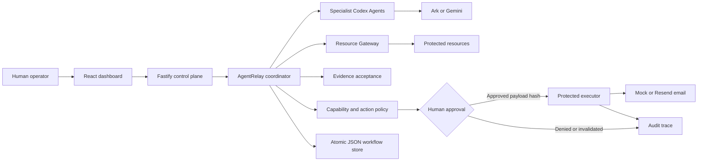

# AgentRelay

AgentRelay is a policy-enforced multi-agent workflow platform for coordinating
specialist AI Agents across research, finance, strategy, and outreach. It adds
server-owned permissions, protected-resource access, evidence validation,
payload-bound human approval, and exactly-once execution to a Codex-powered
Agent runtime.

The included sales-recovery workflow demonstrates how Agents can collaborate
without receiving unrestricted access to sensitive data or external actions.

## Demo

See the [demo SOP](docs/DEMO.md) for the complete presentation flow.

## What we built

AgentRelay runs a dependency-aware sales-recovery workflow:

1. Research and Finance Agents execute independently and in parallel.
2. Their outputs pass through evidence acceptance and source checks.
3. The Strategy Agent receives only accepted evidence from its dependencies.
4. The Outreach Agent proposes a structured external action.
5. Server-owned policy classifies the action and determines whether it can run.
6. A human approves or denies the exact payload-bound action.
7. The trusted executor performs an approved action exactly once.
8. The dashboard presents the workflow state, evidence, access decisions,
   approvals, receipts, and audit trace.

## Key features

- Dependency-aware multi-agent orchestration
- Capability-based Agent routing
- Evidence validation and provenance checks
- Run-scoped protected-resource grants
- Server-owned action and tool policies
- Payload-bound human approval
- Atomic idempotency enforcement
- Retry, timeout, and recovery handling
- Persistent sessions, traces, approvals, and receipts
- Read-only policy simulation
- Volcengine Ark and Gemini model support
- Mock email delivery and optional Resend execution
- Docker, Podman, Colima, and Volcengine ECS deployment paths

## Security guarantees

- Agent-provided risk claims never override the server-owned action registry.
- Agents cannot approve their own protected actions.
- The browser submits only an approval decision, not replacement action data.
- Approval is bound to the exact action payload hash.
- Protected resources are read through run-scoped grants and the Resource
  Gateway.
- Model and executor credentials remain in trusted server/runtime boundaries.
- Unregistered, prohibited, and under-permitted actions fail closed.
- Concurrent duplicate executions produce one external side effect.
- Sensitive action values are redacted from persisted traces and execution
  records.

See [SECURITY.md](SECURITY.md) and the
[threat model](docs/threat-model.md) for the detailed trust boundaries.

## Architecture




The coordinator owns task ordering and routes each task to a registered Agent.
The Resource Gateway evaluates protected reads against server-issued grants.
Proposed actions are evaluated against the server-owned policy registry before
approval or execution. The executor independently verifies approval and claims
an atomic idempotency key before producing a side effect.

See [docs/ARCHITECTURE.md](docs/ARCHITECTURE.md) for component contracts and
extension boundaries.

## Demo scenarios

### Normal workflow

Runs the complete evidence, strategy, approval, and protected-execution path.
After approval, the mock executor creates a persisted receipt.

### Policy denial

The Outreach Agent proposes a controlled prohibited action. The server records
`policy.denied`, degrades the session, and creates neither an approval request
nor an execution receipt.

### Timeout and retry

The Research task encounters a controlled timeout. The coordinator records
retry events and keeps dependent tasks blocked if recovery is exhausted.

### Resource-scope breach

The Research Agent attempts to read Finance data outside its run-scoped grant.
The Resource Gateway denies the request without returning protected data.

### Approval bypass protection

The workflow attempts to execute `SEND_EMAIL` without a satisfied approval.
The trusted execution boundary refuses the action.

### Duplicate approval and idempotency

Five concurrent executions race using the same approved action. The atomic
ledger admits one execution, rejects four duplicates, and produces one email
receipt.

## Technology stack

| Layer | Technology |
| --- | --- |
| Web application | React, TypeScript, Vite |
| API and control plane | Fastify, TypeScript |
| Agent runtime | Codex CLI |
| Model providers | Volcengine Ark or Gemini |
| Validation | Zod |
| Persistence | Atomic JSON stores |
| Tests | Vitest |
| Local runtime | Docker, Podman, or Colima |
| Cloud deployment | Docker and Terraform on Volcengine ECS |

## Quick start

### Requirements

- Node.js 22+
- npm 10+
- A Volcengine Ark or Gemini API key
- Codex CLI for direct development
- Docker, Podman, or Colima for the containerized POC

### Install

```bash
git clone <repository-url> agentrelay
cd agentrelay
npm install
cp .env.example .env
```

### Configure a model provider

For Volcengine Ark, set these values in `.env`:

```dotenv
ARK_API_KEY=your-ark-api-key
ARK_MODEL=ep-your-endpoint-id
ARK_BASE_URL=https://ark.cn-beijing.volces.com/api/v3
```

For Gemini:

```dotenv
MODEL_PROVIDER=gemini
GEMINI_API_KEY=your-gemini-api-key
GEMINI_MODEL=gemini-3.6-flash
```

Generate separate Launchpad and protected-executor tokens:

```bash
openssl rand -hex 32
openssl rand -hex 32
```

Add the two different values to `.env`:

```dotenv
APP_AUTH_TOKEN=your-launchpad-token
AGENTRELAY_EXECUTOR_TOKEN=your-separate-executor-token
```

Never commit `.env` or place real credentials in `.env.example`.

### Run in development

Install the Codex CLI version used by the project:

```bash
npm install --global @openai/codex@0.111.0
```

For direct host development, use local runtime paths in `.env`:

```dotenv
APP_DATA_DIR=.data
AGENT_WORKSPACE_ROOT=workspaces
CODEX_HOME=codex-home
```

Start the frontend and backend together:

```bash
npm run dev
```

- Dashboard: <http://localhost:5173>
- API: <http://localhost:3000>
- Health check: <http://localhost:3000/api/health>

Enter the value of `APP_AUTH_TOKEN` when the dashboard asks for the Launchpad
token.

### Run the containerized POC

```bash
npm run poc
```

The startup script installs dependencies, builds the Runtime image, and selects
Docker, Colima, or Podman. Open <http://localhost:3000> when it is ready.

Force Podman when more than one container engine is installed:

```bash
CONTAINER_ENGINE=podman npm run poc
```

Press `Ctrl+C` to stop the POC. Agent workspaces and conversations remain in
the configured local data directory.

## Demo setup

Provision or update the four specialist Agents through the normal Agent
persistence path:

```bash
npm run seed:agentrelay-demo
```

The command is idempotent and prints the persisted Agent IDs. To clear workflow
sessions, approvals, traces, execution records, and mock receipts while
preserving the Agents and their workspaces:

```bash
npm run reset:agentrelay-demo
```

Protected inputs live under `fixtures/sales-recovery/protected/`. They are not
copied or mounted into Agent workspaces.

## Docker Compose

Create the local configuration:

```bash
./scripts/bootstrap-local.sh
```

Then start the platform:

```bash
docker compose up --build
```

Open <http://localhost:3000>. Stop it without deleting Agent data:

```bash
docker compose down
```

## Configuration

| Variable | Default | Purpose |
| --- | --- | --- |
| `MODEL_PROVIDER` | `ark` | Selects the Ark or Gemini model bridge. |
| `ARK_API_KEY` | Required for Ark | Volcengine Ark API key. |
| `ARK_MODEL` | Required for Ark | Responses-compatible endpoint or model ID. |
| `GEMINI_API_KEY` | Required for Gemini | Server-side Gemini API key. |
| `GEMINI_MODEL` | Provider default | Gemini model used by the Responses bridge. |
| `APP_AUTH_TOKEN` | Empty on loopback | Shared dashboard access token. Use 24+ characters remotely. |
| `AGENTRELAY_EXECUTOR_TOKEN` | Required | Separate credential held by the protected executor. |
| `EMAIL_EXECUTOR` | `mock` | Uses `mock` or the optional `resend` executor. |
| `RUNTIME_PROVIDER` | `local-process` | Uses a local process or disposable Runtime container. |
| `CODEX_SANDBOX_MODE` | `workspace-write` | Codex inner sandbox mode. |
| `CODEX_TIMEOUT_MS` | `600000` | Maximum duration of one Agent turn. |
| `APP_DATA_DIR` | `/app/data` | Session and application metadata directory. |
| `AGENT_WORKSPACE_ROOT` | `/app/workspaces` | Persistent Agent workspace root. |
| `LOCAL_POC_DATA_ROOT` | Platform-specific | Containerized POC state directory. |

See [.env.example](.env.example) for all model, email, runtime, resource-limit,
and deployment settings.

## Optional Resend execution

The mock email executor is the safe default. To demonstrate real delivery, use
only a verified sender and a team-owned test inbox:

```dotenv
EMAIL_EXECUTOR=resend
RESEND_API_KEY=re_your-scoped-key
RESEND_FROM=AgentRelay <verified-sender@example.com>
RESEND_TO_OVERRIDE=team-owned-test-inbox@example.com
```

Agent-provided recipient addresses never control real delivery; Resend always
uses `RESEND_TO_OVERRIDE`.

## Validation

```bash
npm run check
terraform fmt -check -recursive deploy/volcengine
LAUNCHPAD_ENV_FILE=.env.example docker compose config
```

`npm run check` runs type checking, the server and web test suites, and both
production builds.

## Project structure

```text
apps/
  server/                  Fastify API, coordinator, policy, and executors
  web/                     React dashboard and policy simulator
fixtures/
  sales-recovery/          Controlled protected demo resources
docs/                      Architecture, demo, security, and deployment guides
deploy/volcengine/         Terraform configuration
scripts/                   Local bootstrap, resource, and deployment tools
```

## Deployment

- [Existing Linux ECS with Docker](docs/DEPLOYMENT.md#existing-linux-ecs)
- [Complete Volcengine environment with Terraform](docs/DEPLOYMENT.md#terraform-deployment)
- [Local Docker, Colima, and Podman details](docs/LOCAL_POC.md)

Deploy the current source tree to an existing ECS host:

```bash
cp .env.example .env.production
./scripts/deploy-existing-ecs.sh .env.production
```

Provision a Volcengine environment with Terraform:

```bash
cp deploy/volcengine/terraform.tfvars.example \
  deploy/volcengine/terraform.tfvars
./scripts/deploy-volcengine.sh
```

## Documentation

- [Demo SOP](docs/DEMO.md)
- [Architecture](docs/ARCHITECTURE.md)
- [Threat model](docs/threat-model.md)
- [Security policy](SECURITY.md)
- [Local POC guide](docs/LOCAL_POC.md)
- [Deployment guide](docs/DEPLOYMENT.md)
- [Hackathon extension guide](docs/HACKATHON_EXTENSION_GUIDE.md)
- [Contributing](CONTRIBUTING.md)

## License

[MIT](LICENSE)
