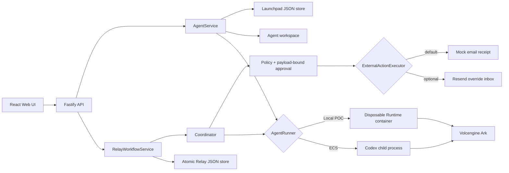

# Architecture

Volc Agent Launchpad is a single-node control plane for hackathon use.



## Components

### Web UI

Lists Agents, manages lifecycle actions, submits prompts, and polls asynchronous
Runs. It never receives the Ark API key.

### Fastify API

Validates requests, protects remote demos with a shared bearer token, and
serves the compiled Web UI. The token is not user identity or authorization.

### AgentService

Coordinates lifecycle state, persistence, workspaces, and Runs. One Agent can
have only one active Run.

```text
ready -> busy -> ready
  |       |
  v       v
stopped  error
```

Interrupted Runs become `cancelled` after a restart.

### Storage

```text
data/launchpad.json       Agent, message, and Run metadata
data/agentrelay.json      Relay sessions, tasks, evidence, traces, approvals, receipts
workspaces/AgentID/       Agent-created files
workspaces/.deleted/      Archived deleted workspaces
codex-home/               Codex configuration and sessions
```

`JsonStore` serializes writes and atomically replaces one JSON file. It supports
one process only.

`RelayJsonStore` applies the same single-process atomic-write constraint to the
middleware aggregate. Approval-ready sessions survive restart. A workflow that
was actively running during restart is marked failed with an audit event rather
than silently resumed or reported as successful.

### AgentRelay trust boundary

- Agents receive only controlled fixture handles and accepted dependency evidence.
- Agent output is validated and recorded as untrusted proposed actions.
- Risk metadata comes exclusively from the server-owned action registry.
- Approval binds the action type, target, and canonical payload hash.
- Executors accept only `ApprovedAction`; they revalidate the hash and enforce
  an idempotency key before creating a receipt.
- Resend credentials and the real recipient override remain server-side.

### Runtime providers

- `CodexRunner` runs Codex inside the application container for ECS.
- `ContainerCodexRunner` starts one disposable Docker, Colima, or Podman
  container for every local turn.

Both providers use argv-only process execution, bound output and time, resume
the stored Codex thread, and escalate termination after a grace period.

## Deployment profiles

| Profile | Control plane | Agent execution |
| --- | --- | --- |
| Local POC | Host Node.js | Disposable local container |
| ECS | Application container | Codex process in the same container |
| Local development | Host Node.js | Host Codex process |

## Extension seams

| Track | Primary seam | Expected change |
| --- | --- | --- |
| Glass Box | `AgentRunner`, `AgentRun` | Emit and display correlated execution events. |
| Bouncer | API routes, Agent ownership | Add identity and server-side authorization. |
| Kill Switch | `AgentRunner` | Add threat-specific policy or a stronger sandbox. |

The current container or ECS instance is the POC trust boundary. Ordinary
containers are not hardened multi-tenant isolation.
