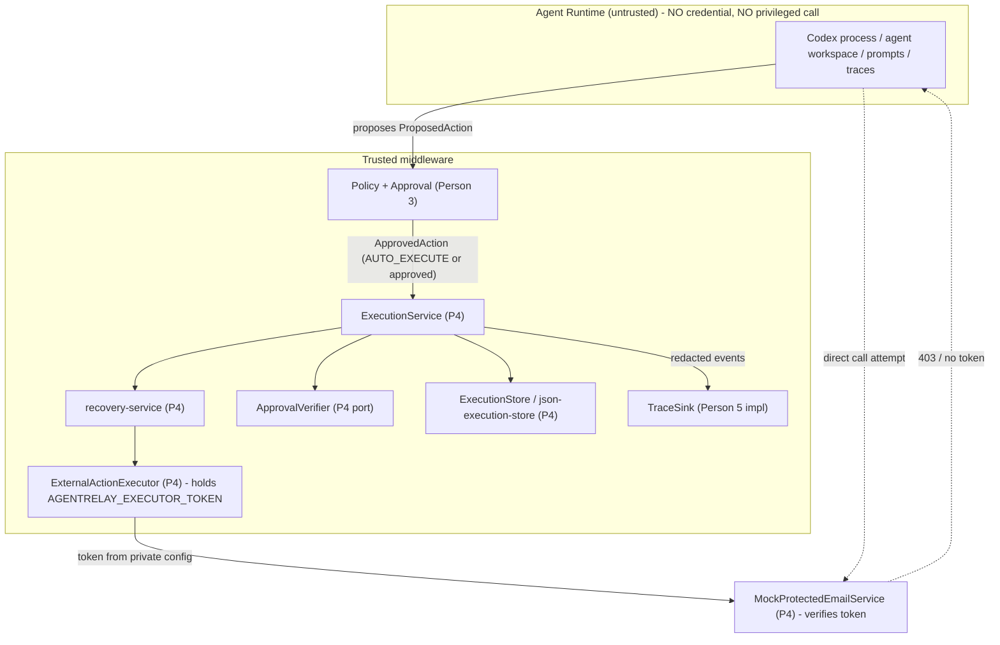
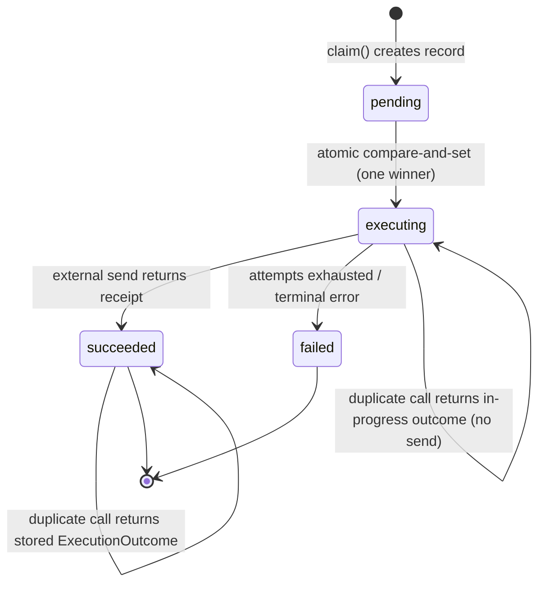
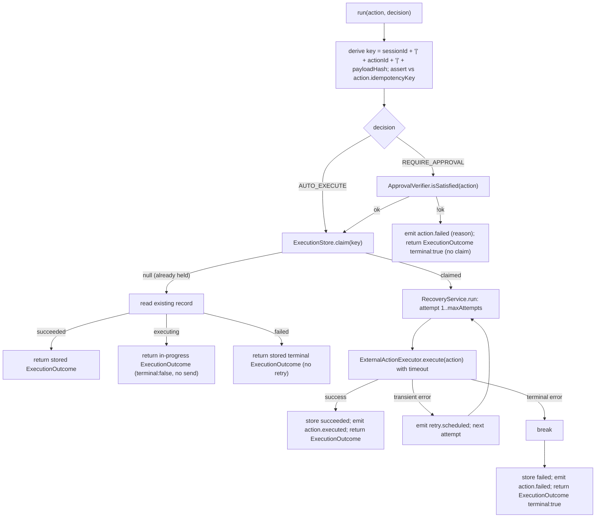

# AgentRelay Person 4: Hard Enforcement, Idempotency & Reliability - Plan

Person 4 owns the security-critical runtime boundary: the single enforced route by which an agent-proposed action becomes a real external side effect. This plan covers the 3-day P0 build defined in `PERSON_4_OWNERSHIP.md` and `AgentRelay_5_Person_3_Day_Implementation_Plan.md` (§ "Person 4").

---

## Goal Capsule

- **Objective:** An agent-proposed protected side effect (`SEND_EMAIL`) can reach the external service only after policy and, when required, a payload-bound human approval; it then executes exactly once. Every other route — direct service call, missing or forged credential, unapproved or denied action, modified-payload replay, duplicate request, retry after success — fails closed. A reviewer outside the middleware can verify this from the test suite alone.
- **Means:** A trusted `ExternalActionExecutor` that is the sole holder of the executor token, fronted by an `ExecutionService` that enforces approval and an atomic idempotency guard, with a `recovery-service` for timeout/retry/terminal-failure. `ExecutionService.run` returns a Person-4-owned `ExecutionOutcome`, not a bare `ActionResult`, so the terminal-failure signal reaches the Coordinator (KTD1, KTD2, KTD3, KTD9, KTD10).
- **Authority:** `PERSON_4_OWNERSHIP.md` is the scope authority; the spec (`AgentRelay_TechJam_Engineering_Spec_v2.md` §§ 13, 14, 15, 21, 22) and implementation plan win on any conflict with this document.
- **Stop conditions:** Stop and raise a cross-team contract question if a task appears to require editing another person's module or `apps/server/src/domain/**`. Stop if the executor token would need to enter a `ProposedAction`, an `ApprovedAction`, a trace event, an API response, a fixture, or a runner env allowlist.
- **Execution profile:** Contract-first. Every module ships production impl + in-memory/mock deps + colocated Vitest unit tests + a fixture. Build against fakes for Persons 1/3/5; integration is dependency injection.
- **Tail ownership:** Person 4 delivers `ExecutionService` and a direct-call test harness. Person 1 owns the Coordinator call site and downstream-blocking on terminal failure. Person 5 owns the Fastify route that calls `ExecutionService`.

---

## Product Contract

### Summary

Build the hard enforcement boundary for AgentRelay's one protected side effect. Deliver a token-gated mock email service, a trusted executor that alone holds the credential, an approval-enforced and idempotent `ExecutionService`, a `recovery-service` for timeout/retry/terminal failure, a JSON execution ledger, the `AGENTRELAY_EXECUTOR_TOKEN` config wiring with a runner-env leak regression test, trace redaction at the executor boundary, and the Day-3 bypass/abuse test suite.

### Problem Frame

AgentRelay's thesis is that one incorrect agent output must not silently become shared truth and trigger a real-world action. Approvals and policy are only advisory if the Agent Runtime (the Codex process, agent workspace, browser, prompts, traces) can perform the protected side effect directly. The enforcement boundary is what makes approval enforced: the credential and the privileged call live in exactly one trusted component, and there is exactly one code path to it. This is the highest-priority implementation invariant in the project (spec § 25). Without it, every other guarantee — scoped evidence, the automation decision gate, payload-bound approval — can be bypassed.

### Requirements

#### Credential isolation and the protected boundary

- R1. `MockProtectedEmailService` accepts a send request only when the caller presents the valid executor credential; a request without it, or with a wrong value, is rejected with a 403-shaped error and no email is recorded.
- R2. The executor credential is available only to the `ExternalActionExecutor` (and to the mock service for verification). It never appears in `ProposedAction`, `ApprovedAction`, `ExecutionContext`, any `TraceEvent`, any `/api` response, any fixture, or `codex-home/config.toml`.
- R3. Neither runner's child-process environment (`codex-runner.ts` `childEnvironment()`, `container-codex-runner.ts` `childEnvironment()`, and the container `--env` list) carries `AGENTRELAY_EXECUTOR_TOKEN`. A regression test asserts its absence.
- R4. An "agent-like" caller that attempts the protected side effect without going through the executor path fails (403 / unauthorized / unreachable). The trusted executor path succeeds and returns a receipt.

#### Approval enforcement

- R5. `ExecutionService.run` executes an action only when the `ApprovalVerifier` reports a satisfied, payload-bound approval for that exact action, or the action's decision was `AUTO_EXECUTE`. `NO_APPROVAL`, `APPROVAL_DENIED`, `APPROVAL_INVALIDATED`, and `HASH_MISMATCH` all stop execution.
- R6. Person 4 enforces the approval decision; it never re-derives policy, risk, impact, or the automation decision.

#### Idempotency — exactly once

- R7. The execution record is keyed by `sessionId + actionId + payloadHash`. States are `pending → executing → succeeded | failed`.
- R8. The transition into `executing` is a single atomic compare-and-set on the store, not a read-then-write. Two concurrent calls for the same key produce exactly one external send.
- R9. A call whose key is already `succeeded` returns the stored prior result and does not re-send. A call whose key is `executing` is rejected or returns in-progress and does not double-fire.

#### Reliability

- R10. A protected execution has a timeout. Transient failure (timeout, service 5xx-equivalent) is retried up to `maxAttempts`. `403`, approval failure, and validation failure are terminal and never retried.
- R11. When attempts are exhausted, the execution record is `failed`, a terminal-failure result is returned, and `ExecutionService` exposes a signal the Coordinator uses to keep downstream tasks blocked. No silent skip.

#### Observability

- R12. Before any `TraceSink.append`, the executor boundary redacts credential/bearer-pattern values and replaces the external payload with a summary (for example `payloadSummary: "Campaign email, 482 chars"`). Redaction happens before persistence, not before rendering.
- R13. The execution ledger (`json-execution-store`) persists only `payloadHash`, never `SendEmailPayload` fields (`recipient`, `subject`, `body`). A stored `result` keeps `status`, `externalReference`, and a redacted `error` string only. The executor token never reaches the ledger.

### Success Criteria

- All Day-3 attack tests pass (§ Definition of Done lists them). `npm run check` is green.
- A reviewer can point to one test that proves "duplicate request executes once" and one that proves "direct agent-side call fails", without reading terminal logs.
- Baseline Agent CRUD, the Playground, and existing server tests still pass — no Layer 1 regression beyond the two sanctioned config edits.

### Scope Boundaries

In scope: the files listed in `PERSON_4_OWNERSHIP.md` § 1 plus the two sanctioned config edits (`config.ts`, `.env.example`).

Out of scope:

- Fastify `/api/middleware/*` routes and `json-trace-store.ts` (Person 5). Person 4 exposes `ExecutionService` and emits trace events through an injected `TraceSink`.
- Coordinator wiring and the actual downstream-blocking behavior (Person 1). Person 4 emits the terminal-failure signal; Person 1 consumes it.
- Risk classification, the automation decision gate, and approval record writes (Person 3). Person 4 reads approval state through the `ApprovalVerifier` port.
- Any change to `apps/server/src/domain/**`. New contracts land in a Person-4-owned file (KTD2).
- Real email delivery; a real HTTP transport for the mock service (KTD1).
- UI.

#### Deferred to Follow-Up Work

- **Controlled degraded / stale-evidence path.** The spec (§ 15.2) marks this "only if core P0 is already stable". Not built in this plan. `recovery-service` and the terminal-failure result type are shaped so a `degraded` branch (fallback evidence marked `stale`, session `degraded`, explicit stale marker propagated, fallback never presented as fresh) can be added later without reworking the retry loop or the `ExecutionService` surface.
- **Optional HTTP façade for the mock service.** If the team's architecture diagram commits to an HTTP trust boundary for the demo, Person 5 can mount `MockProtectedEmailService` behind a route; the in-process `send()` contract does not change (KTD1).

### Sources

- `PERSON_4_OWNERSHIP.md` — scope, owned files, day-by-day exit criteria, contracts consumed and defined, credential-handling steps (§ 6).
- `AgentRelay_TechJam_Engineering_Spec_v2.md` §§ 4.3, 13, 14, 15.1, 16.2, 21, 22.
- `AgentRelay_5_Person_3_Day_Implementation_Plan.md` — "Person 4" and the per-day team exit criteria.
- Frozen contracts: `apps/server/src/domain/action.ts`, `protected-action.ts`, `ports.ts`, `approval.ts`, `trace.ts`, `evidence.ts`.
- Patterns: `apps/server/src/store.ts` (`JsonStore.mutate` serialize-then-atomic-rename), `apps/server/src/errors.ts` (`HttpError`), `apps/server/src/store.test.ts` (Vitest + `mkdtemp` fixture style), `apps/server/src/codex-runner.ts:242` and `apps/server/src/container-codex-runner.ts:240` (`childEnvironment()` allowlists).

---

## Planning Contract

### Key Technical Decisions

- KTD1. **In-process `MockProtectedEmailService` with a token-checked `send()` method, not a real loopback HTTP listener.** (session-settled: user-directed — chosen over a real HTTP listener: no port/process management, simpler tests; the bypass test becomes a code-level assertion that the Agent-Runtime path holds no executor reference and that `send()` rejects a request without the verified token.) The method signature and the `ProtectedEmailReceipt` return shape match what an HTTP route would expose, so Person 5 can wrap it later. Rejection uses a `ProtectedServiceAuthError` carrying `statusCode: 403` so "403 / unauthorized" reads the same in code and in any future HTTP mapping. Residual risk: the one-page architecture diagram must not show an enforced HTTP boundary that the implementation lacks — raise this at the Day-1 team sync.
- KTD2. **New contracts live in `apps/server/src/application/execution-ports.ts`, owned by Person 4.** `domain/**` is frozen. `ApprovalVerifier`, `ExecutionRecord`, `ExecutionRecordStatus`, `ExecutionStore`, and `ExecutionService` are defined there and proposed to the team on Day 1. Move them into `domain/ports.ts` later only on team agreement. Governs R5, R7.
- KTD3. **The `pending → executing` claim is a compare-and-set inside one `JsonStore`-style mutation.** Reuse the serialize-through-a-promise-queue-then-atomic-rename pattern from `store.ts`. The claim mutation reads the record and sets it to `executing` in the same critical section; it returns the claimed record, or `null` when another caller already holds it (the caller then reads the existing record). No `if (!alreadyExecuted) execute()`. Governs R8.
- KTD4. **`payloadHash` is consumed from the `ApprovedAction`, never recomputed with a different algorithm.** Person 3 computes `hash(type + target + canonicalJson(payload))`. Person 4 derives the idempotency key as `sessionId + actionId + payloadHash` from the action's fields and, when `action.idempotencyKey` is present, asserts it matches. Governs R7.
- KTD5. **Retry classification is a fixed table; delay is minimal and fixed (or zero).** Transient: timeout, mock-service transient failure. Terminal: `ProtectedServiceAuthError` (403), approval failure, Zod validation failure. No exponential backoff in P0 — deterministic tests matter more than realistic pacing. Governs R10.
- KTD6. **The executor token is validated at executor construction, not globally.** `config.ts` adds `AGENTRELAY_EXECUTOR_TOKEN: z.string().min(24).optional()`. `mock-action-executor.ts` throws on construction if the protected executor is enabled and the token is absent or starts with `replace-`. This keeps existing server startup working when the token is unset. Governs R2.
- KTD7. **Trace redaction is a Person-4 helper applied at the executor boundary before `TraceSink.append`.** It strips values matching the token and bearer-token patterns and replaces `payload` with `payloadSummary`. `ExecutionService` and the executor never pass raw payloads or secrets to the sink. Governs R12.
- KTD8. **`ApprovalVerifier` is a port with test doubles, not a dependency on Person 3's `approval-service`.** `AlwaysApprovedVerifier` and `AlwaysDeniedVerifier` for isolated development; the production impl (thin adapter over Person 3's approval state) is wired at integration. Governs R5.
- KTD9. **`ExecutionService.run` takes the `AutomationDecision` alongside the action.** `ApprovedAction` (frozen) does not carry the decision, so `run(action, decision)` is the surface. `decision === "AUTO_EXECUTE"` skips the approval lookup; `decision === "REQUIRE_APPROVAL"` requires `ApprovalVerifier` to find an `ApprovalRecord` with `status: "approved"`, `actionId` match, and `actionHash === action.payloadHash` (the two fields hold the same `hash(type + target + canonicalJson(payload))` value — see Open Questions). `DENY` / `RECOMMEND_ONLY` never reach Person 4. This changes the `PERSON_4_OWNERSHIP.md` § 4 signature (`run(action)`); raise at the Day-1 sync. Governs R5, R6.
- KTD10. **The terminal-failure signal is a Person-4 `ExecutionOutcome` type, not a field on `ActionResult`.** `domain/action.ts` `ActionResult` is frozen as `{ status, externalReference?, error? }` with no metadata channel. `execution-ports.ts` defines `ExecutionOutcome { result: ActionResult; terminal: boolean; reason?: string }` and `ExecutionService.run` returns it. The Coordinator reads `outcome.terminal` to keep downstream blocked. Governs R11.

### High-Level Technical Design

Directional guidance for review, not implementation specification below.

#### Trust boundary and components

#### Execution record state machine

#### `ExecutionService.run(action, decision)` flow

### Assumptions

- Persons 1/3/5 consume `ExecutionService.run` and produce `ApprovedAction` per the frozen `domain/action.ts` shape. Integration is dependency injection, not rewrites.
- Person 3's `ApprovedAction` carries a usable `payloadHash`. If `idempotencyKey` is not yet populated by Person 3, Person 4 derives it from the three component fields (KTD4) and this is confirmed at the Day-1 sync.
- The `SendEmailPayload` shape (`recipient`, `subject`, `body`, no credential field) from `domain/protected-action.ts` is what agents propose for `SEND_EMAIL`.
- Vitest, colocated `*.test.ts`, NodeNext ESM with `.js` import extensions, `strict` + `noUncheckedIndexedAccess` + `exactOptionalPropertyTypes`.
- `ExecutionService` is constructed with its dependencies injected (`ApprovalVerifier`, `ExecutionStore`, `ExternalActionExecutor`, `RecoveryService`, `TraceSink`), so tests supply fakes.

### Open Questions

- OQ1. **The `ExecutionService.run` / `ApprovalVerifier` surface must carry the `AutomationDecision`.** `ApprovedAction` cannot (it is frozen). KTD9 proposes `run(action, decision)`. Confirm with Person 3 on Day 1: does Person 3 call `ExecutionService` only for `AUTO_EXECUTE` and approved `REQUIRE_APPROVAL` actions, and does Person 3 pass the decision, or does Person 4 look it up? Non-blocking: U6 proceeds on the `run(action, decision)` default (KTD9); the Day-1 sync only confirms who supplies the decision.
- OQ2. **`ApprovedAction.payloadHash` vs `ApprovalRecord.actionHash`.** Both should hold `hash(type + target + canonicalJson(payload))`. Confirm Person 3 populates them from the same function so the production `ApprovalVerifier` can compare them directly. Deferred to integration; does not block isolated development against fakes.

### Sequencing

Day 1 delivers U1–U4 (the boundary, provable with fakes only). Day 2 delivers U5–U8 (idempotency, reliability, config). Day 3 delivers U9 (attack suite + redaction test + `npm run check`). U1 blocks everything. U8 is independent of U5–U7 and can be done any time on Day 2.

---

## Implementation Units

### U1. Scaffold `application/` + `adapters/` and define Person-4 execution ports

- **Goal:** Create the directory structure and the type-only contracts Person 4 owns, so every later unit compiles against a stable surface.
- **Requirements:** R5, R6, R7, R10, R11, R13 (contract shapes). Open Questions: OQ1.
- **Dependencies:** none.
- **Files:**
  - `apps/server/src/application/execution-ports.ts` (create)
  - `apps/server/src/adapters/` (create directory; add a `.gitkeep` or the first adapter in U2)
- **Approach:**
  1. Define `ApprovalVerifier` with `isSatisfied(action: ApprovedAction): Promise<{ ok: true } | { ok: false; reason: "NO_APPROVAL" | "APPROVAL_DENIED" | "APPROVAL_INVALIDATED" | "HASH_MISMATCH" }>`.
  2. Define `ExecutionRecordStatus = "pending" | "executing" | "succeeded" | "failed"` and `ExecutionRecord` (`idempotencyKey`, `sessionId`, `actionId`, `payloadHash`, `status`, `attempts`, `result?: ActionResult`, `createdAt`, `updatedAt`).
  3. Define `ExecutionStore` with `get(key)`, `claim(seed)` returning `ExecutionRecord | null`, and `update(record)`.
  4. Define `ExecutionOutcome { result: ActionResult; terminal: boolean; reason?: string }` — the Coordinator-facing return type (KTD10). `terminal: true` means "keep downstream blocked".
  5. Define `ExecutionService` with `run(action: ApprovedAction, decision: AutomationDecision): Promise<ExecutionOutcome>` (KTD9). Import `AutomationDecision` from `domain/action.js`.
  6. Define the executor error classes `TransientExecutionError` and `ActionValidationError` (terminal), alongside the `ProtectedServiceAuthError` from U2, so `recovery-service` classifies by error type (KTD5, U7).
  7. Re-export nothing from `domain/`; import types from `domain/index.js`.
- **Patterns to follow:** the interface style in `apps/server/src/domain/ports.ts`; `PERSON_4_OWNERSHIP.md` § 4 "Contracts I define and own" is the reference shape.
- **Test scenarios:**
  - Test expectation: none -- type-only module, no runtime behavior. Compilation is covered by `npm run typecheck`.
- **Verification:** `npm run typecheck -w @launchpad/server` passes with the new file present and imported by a scratch consumer.

### U2. `MockProtectedEmailService` — token-gated, deterministic

- **Goal:** The "external" service. It records a send only when the caller presents the valid executor token.
- **Requirements:** R1.
- **Dependencies:** U1.
- **Files:**
  - `apps/server/src/adapters/mock-protected-email-service.ts` (create)
  - `apps/server/src/adapters/mock-protected-email-service.test.ts` (create)
  - `apps/server/src/errors.ts` (add `ProtectedServiceAuthError`) — this is a Layer 1 file; confirm at Day-1 sync that adding one narrow error class here is acceptable, else colocate the class in the adapter.
- **Approach:**
  1. Class with a private `expectedToken` constructor arg and a `send(token: string, request: ProtectedEmailRequest): Promise<ProtectedEmailReceipt>` method.
  2. `send` throws `ProtectedServiceAuthError` (`statusCode: 403`) when `token` is empty, undefined, or not equal to `expectedToken` (use a constant-time compare helper mirroring `app.ts`'s `timingSafeEqual` usage).
  3. On success, append `{ sessionId, actionId, payload }` to an in-memory `sent[]` ledger and return `{ messageId, acceptedAt }` where `messageId` is deterministic (for example `msg-${actionId}` or a counter) and `acceptedAt` is an injectable clock's ISO string.
  4. Expose a read-only `sentCount` / `sent` accessor for tests.
- **Patterns to follow:** `apps/server/src/errors.ts` `HttpError` shape; deterministic-clock injection.
- **Test scenarios:**
  - Happy path: `send(validToken, request)` returns a receipt with a deterministic `messageId`; `sentCount` is 1.
  - Missing token: `send("", request)` throws `ProtectedServiceAuthError` with `statusCode: 403`; `sentCount` stays 0.
  - Wrong token: `send("wrong", request)` throws; `sentCount` stays 0.
  - Determinism: two services built with the same seed clock produce identical receipts for the same request.
  - Two distinct successful sends produce two distinct `messageId` values.
- **Verification:** the test file passes; no timing-dependent assertions.

### U3. `ExternalActionExecutor` (`mock-action-executor.ts`) — the only credential holder

- **Goal:** Implement `domain/ports.ts` `ExternalActionExecutor`. Map an `ApprovedAction` to a `ProtectedEmailRequest`, validate it, and call `MockProtectedEmailService` with the token from private config.
- **Requirements:** R2, R4, R12.
- **Dependencies:** U1, U2.
- **Files:**
  - `apps/server/src/adapters/mock-action-executor.ts` (create)
  - `apps/server/src/adapters/mock-action-executor.test.ts` (create)
  - `apps/server/src/adapters/redact-trace.ts` (create — the redaction helper)
  - `apps/server/src/adapters/redact-trace.test.ts` (create)
- **Approach:**
  1. Constructor takes `{ token: string, service: MockProtectedEmailService, now?: () => Date }`. Throw if `token.length < 24` or `token.startsWith("replace-")` (KTD6).
  2. `execute(action: ApprovedAction): Promise<ActionResult>` — one fixed error convention (removes the U7 ambiguity): the executor **throws** typed errors for every failure and returns an `ActionResult` only on success.
     - Zod-parse `action.payload` against a `SendEmailPayload` schema. On failure throw `ActionValidationError` (terminal). Never partially act on a bad payload.
     - Throw `ActionValidationError` when `action.type !== PROTECTED_ACTION_TYPE`.
     - Call `service.send(this.token, { sessionId, actionId, payload })`.
     - On success return `{ status: "succeeded", externalReference: receipt.messageId }`.
     - `ProtectedServiceAuthError` propagates (terminal). Wrap a mock-service transient failure or a timeout as `TransientExecutionError` (retryable). `recovery-service` (U7) classifies purely by caught error type.
  3. `redact-trace.ts`: `redactActionMetadata(input): Record<string, unknown>` — drop any string equal to the token or matching `/bearer\s+/i` / long hex/base64 secret patterns; replace `payload` with `payloadSummary: "<type>, <body length> chars"` and keep `target` (recipient).
  4. The executor emits nothing to a sink directly; it returns results. `ExecutionService` (U6) owns trace emission using `redactActionMetadata`.
- **Patterns to follow:** Zod validation per repo conventions ("An invalid agent result fails the task attempt"); `domain/protected-action.ts` for the payload and request shapes.
- **Test scenarios:**
  - Happy path: valid `ApprovedAction` → `MockProtectedEmailService` receives one send with the correct token → result `{ status: "succeeded", externalReference }`.
  - Construction guard: building the executor with a `replace-...` token throws; with a 10-char token throws.
  - Wrong action type: `action.type = "CREATE_INTERNAL_DRAFT"` → throws `ActionValidationError`, no send.
  - Invalid payload: `payload` missing `recipient` → throws `ActionValidationError`, no send.
  - Transient wrap: a mock service configured to fail transiently → `execute` throws `TransientExecutionError`.
  - Credential isolation: the token is never present in the returned `ActionResult` nor in any object the executor exposes.
  - Redaction (`redact-trace.test.ts`): metadata containing the raw token → token absent from output; `payload` body replaced by `payloadSummary` with the correct char count; `recipient` preserved.
  - Redaction: a `bearer <jwt>` string in metadata is stripped.
- **Verification:** both test files pass; grep the executor's public surface for the token variable name shows it only in the private field.

### U4. `ApprovalVerifier` fakes and the bypass test

- **Goal:** Provide `AlwaysApprovedVerifier` / `AlwaysDeniedVerifier`, and prove the hard enforcement boundary end-to-end with fakes only — the single most important Day-1 security deliverable.
- **Requirements:** R4, R5.
- **Dependencies:** U1, U2, U3.
- **Files:**
  - `apps/server/src/application/approval-verifier-fakes.ts` (create)
  - `apps/server/src/adapters/bypass.test.ts` (create)
- **Approach:**
  1. `AlwaysApprovedVerifier` returns `{ ok: true }`; `AlwaysDeniedVerifier` returns `{ ok: false, reason: "APPROVAL_DENIED" }`; add a `StubApprovalVerifier` that returns a configured result for finer tests.
  2. Bypass test — the negative path: construct an "agent-like client" that only has what the Agent Runtime has (the `ProposedAction`, no token, no executor reference). Assert it cannot produce a successful send: a direct `service.send(agentSuppliedValue, request)` throws `ProtectedServiceAuthError` for every value the agent could plausibly supply (empty, the app auth token, a guessed string).
  3. Bypass test — the sanctioned path: `ProposedAction` → (fake) approval satisfied → `ExternalActionExecutor.execute` with the real private token → `MockProtectedEmailService` records exactly one send and returns a receipt.
  4. Assert the `ProposedAction` / `ExecutionContext` objects used on the agent side contain no field equal to the executor token.
- **Patterns to follow:** `apps/server/src/store.test.ts` structure (describe/it, deterministic fixtures).
- **Test scenarios:**
  - Direct call with no token → 403-shaped error, `sentCount` 0.
  - Direct call with the `APP_AUTH_TOKEN` value → still 403 (the two credentials are distinct).
  - Sanctioned path with `AlwaysApprovedVerifier` → one send, receipt returned.
  - Sanctioned path with `AlwaysDeniedVerifier` → no send, terminal failure.
  - The agent-side `ProposedAction` and `ExecutionContext` fixtures contain no value equal to the executor token.
- **Verification:** `npm run test -w @launchpad/server -- src/adapters/bypass.test.ts` passes. Day-1 exit criterion met: boundary proven with zero other AgentRelay components.

### U5. `json-execution-store.ts` and an in-memory `ExecutionStore`

- **Goal:** Persist execution records with an atomic `claim`. Provide an in-memory implementation for other people's tests.
- **Requirements:** R7, R8, R13.
- **Dependencies:** U1.
- **Files:**
  - `apps/server/src/adapters/json-execution-store.ts` (create)
  - `apps/server/src/adapters/json-execution-store.test.ts` (create)
  - `apps/server/src/adapters/in-memory-execution-store.ts` (create)
  - `apps/server/src/adapters/in-memory-execution-store.test.ts` (create)
- **Approach:**
  1. `JsonExecutionStore` wraps a `JsonStore`-style serialized write queue over one JSON file (`executions.json`), following `store.ts`: `structuredClone` snapshots on read, temp-file + atomic `rename` on write, all mutations serialized through a promise chain.
  2. `claim(seed)` runs inside one queued mutation: if no record for `key`, create `{ ...seed, status: "pending", attempts: 0 }` then immediately set `status: "executing"` and return it; if a record exists, return `null` (do not mutate). The single-mutation critical section is the atomicity guarantee (KTD3). `seed` carries `idempotencyKey`, `sessionId`, `actionId`, `payloadHash` only — never payload fields (R13).
  3. `update(record)` replaces the record for `record.idempotencyKey` and bumps `updatedAt`. Before writing, assert the record holds no `SendEmailPayload` field and that `result` is `{ status, externalReference?, error? }` only (R13).
  4. `InMemoryExecutionStore` implements the same interface with a `Map` and an `async` mutex (a resolved-promise chain) so `claim` is still single-winner under concurrent calls.
- **Patterns to follow:** `apps/server/src/store.ts` (the whole file); `apps/server/src/store.test.ts` for the temp-dir fixture and the "mutation not visible when persistence fails" style.
- **Test scenarios:**
  - Happy path: `claim` on a fresh key returns an `executing` record; `get` returns it.
  - Second `claim` on the same key returns `null`; the record stays `executing` (not reset to `pending`).
  - Concurrent `claim`: 10 simultaneous `claim` calls for one key → exactly one non-null return, nine `null`.
  - `update` to `succeeded` persists; a fresh store instance reading the same file sees `succeeded`.
  - Persistence failure (bad path) does not leave a half-written record visible in memory (mirror `store.test.ts`).
  - Data-at-rest: after a full succeeded lifecycle, the on-disk `executions.json` contains no `recipient`, `subject`, or `body` value and no token-like string (R13).
  - `InMemoryExecutionStore` passes the same concurrent-claim and state-transition scenarios.
- **Verification:** both test files pass, including the 10-way concurrent claim.

### U6. `ExecutionService` — approval enforcement + idempotency guard

- **Goal:** The public surface Persons 1/5 call. Enforce approval, run the idempotency guard, delegate the retry loop, emit redacted trace events.
- **Requirements:** R5, R6, R7, R8, R9, R12. Open Questions: OQ1.
- **Dependencies:** U1, U3, U4, U5, U7.
- **Files:**
  - `apps/server/src/application/execution-service.ts` (create)
  - `apps/server/src/application/execution-service.test.ts` (create)
- **Approach:** implement the flow in the High-Level Technical Design "`ExecutionService.run(action, decision)` flow" diagram. `run` returns `ExecutionOutcome` (KTD10).
  1. Derive `key = sessionId + "|" + actionId + "|" + payloadHash`; if `action.idempotencyKey` is set, assert equality, else proceed (KTD4).
  2. Branch on `decision` (KTD9): `AUTO_EXECUTE` skips approval; `REQUIRE_APPROVAL` calls `ApprovalVerifier.isSatisfied(action)` and on `!ok` emits `action.failed` with the redacted reason and returns `{ result: { status: "failed", error: reason }, terminal: true }`. No store write. `DENY` / `RECOMMEND_ONLY` are a caller error — reject before any side effect.
  3. `ExecutionStore.claim(seed)` → on `null`, `get` the existing record: `succeeded` returns the stored `ExecutionOutcome`; `executing` returns `{ result: { status: "executing" }, terminal: false }` (in-progress, no send); `failed` returns the stored terminal `ExecutionOutcome` (do not retry).
  4. On a fresh claim, emit `action.execution_started`, call `RecoveryService.run(action, ...)` (U7), then `update` the record to `succeeded` (store the outcome) or `failed`, emit `action.executed` or `action.failed`, and return the `ExecutionOutcome`.
  5. Every sink call goes through `redactActionMetadata` (U3).
- **Patterns to follow:** dependency injection via constructor; `domain/trace.ts` `TraceEventType` values (`action.execution_started`, `action.executed`, `action.failed`, `retry.scheduled`).
- **Test scenarios:**
  - Happy path, `decision = AUTO_EXECUTE`: no approval lookup, one send, record `succeeded`, `action.executed` emitted, `ExecutionOutcome` with `terminal: false` returned.
  - `decision = REQUIRE_APPROVAL`, approval satisfied: one send, `succeeded`.
  - `decision = REQUIRE_APPROVAL`, approval denied: no claim, no send, `ExecutionOutcome` `terminal: true`, `action.failed` with `APPROVAL_DENIED`.
  - Approval invalidated / hash mismatch: no send, `terminal: true` with the matching reason.
  - `decision = DENY` or `RECOMMEND_ONLY`: rejected before any side effect (caller contract violation).
  - Duplicate call after `succeeded`: returns the identical stored `ExecutionOutcome`, `MockProtectedEmailService.sentCount` stays 1, no new `action.executed`.
  - Concurrent duplicate: two `run` calls for the same action race → exactly one send, exactly one `succeeded` outcome; the losing caller gets an in-progress `ExecutionOutcome` (`result.status: "executing"`, `terminal: false`) and triggers no send.
  - Call against an `executing` record: returns the in-progress outcome, no send.
  - Call against a `failed` record: returns the stored terminal outcome, no retry, no send.
  - Trace redaction: no emitted event's metadata contains the token or the raw email body; `payloadSummary` present on the executed event.
  - `action.idempotencyKey` mismatch with derived key → rejected before any side effect.
- **Verification:** `npm run test -w @launchpad/server -- src/application/execution-service.test.ts` passes, including both duplicate scenarios.

### U7. `recovery-service.ts` — timeout, retry, terminal failure

- **Goal:** Run a protected execution with a timeout and bounded retries, classify failures, and produce a terminal-failure result the Coordinator can act on.
- **Requirements:** R10, R11.
- **Dependencies:** U1, U3.
- **Files:**
  - `apps/server/src/application/recovery-service.ts` (create)
  - `apps/server/src/application/recovery-service.test.ts` (create)
- **Approach:**
  1. `run(action, { executor, maxAttempts, timeoutMs, delayMs, onRetry }): Promise<ExecutionOutcome>`.
  2. For `attempt` in `1..maxAttempts`: run `executor.execute(action)` under a `Promise.race` with a rejecting timer at `timeoutMs` (a timeout counts as a `TransientExecutionError`). An in-process call cannot be truly aborted; the race abandons a hung attempt.
  3. Classify by caught error type (U3 fixed the convention): no throw → `{ result, terminal: false }`. `TransientExecutionError` → `onRetry(attempt)` (caller emits `retry.scheduled`), wait `delayMs` (injected; 0 in tests), continue. `ProtectedServiceAuthError` or `ActionValidationError` → stop immediately.
  4. After a terminal error or exhausted attempts, return `{ result: { status: "failed", error: <reason> }, terminal: true }`.
  5. `maxAttempts`, `timeoutMs`, `delayMs` come from the caller; provide sane defaults but do not read `config.ts` here (keep the service port-pure).
- **Patterns to follow:** bounded time / escalating termination style from `codex-runner.ts`; no wall-clock `sleep` in tests — inject the delay function.
- **Test scenarios:**
  - Success on attempt 1: one `executor.execute` call, result returned, no retry.
  - Transient then success: attempt 1 times out, attempt 2 succeeds → `onRetry(1)` called once, `succeeded` returned.
  - Transient exhausted: attempts 1 and 2 both time out (`maxAttempts: 2`) → terminal `failed`, `onRetry` called once (before attempt 2), no third attempt.
  - Terminal error is not retried: attempt 1 throws `ProtectedServiceAuthError` → immediate `{ terminal: true }`, `onRetry` never called, `executor.execute` called once.
  - Validation failure is terminal: `ActionValidationError` from the executor → no retry.
  - Timeout fires: an executor that never resolves is abandoned after `timeoutMs` and treated as transient (test with an injected fake timer).
  - The returned `ExecutionOutcome` carries `terminal: true` on exhausted retries and on any terminal error.
- **Verification:** the test file passes with an injected timer/delay (fast, deterministic).

### U8. Wire `AGENTRELAY_EXECUTOR_TOKEN` into config and prove it never leaks to the runners

- **Goal:** Add the setting per `PERSON_4_OWNERSHIP.md` § 6 and lock the leak surface with a regression test.
- **Requirements:** R2, R3.
- **Dependencies:** U1.
- **Files:**
  - `apps/server/src/config.ts` (modify — add the Zod field and expose it on the returned config)
  - `.env.example` (modify — add a placeholder line with a comment)
  - `apps/server/src/config.test.ts` (create or extend — token parsing)
  - `apps/server/src/runner-env-isolation.test.ts` (create — the leak regression test)
- **Approach:**
  1. `config.ts`: add `AGENTRELAY_EXECUTOR_TOKEN: z.string().min(24).optional()` to `envSchema`; surface it as `executorToken: env.AGENTRELAY_EXECUTOR_TOKEN?.trim() ?? ""` in the return object. Do not add a global "must be set" check — validation is at executor construction (KTD6).
  2. `.env.example`: add `AGENTRELAY_EXECUTOR_TOKEN=replace-with-a-separate-long-random-executor-token` under a comment: "Held ONLY by the protected action executor. Never share with the Agent Runtime / Codex / browser / traces."
  3. `runner-env-isolation.test.ts`: set `process.env.AGENTRELAY_EXECUTOR_TOKEN` to a sentinel, construct both runners (or call their `childEnvironment()` via a minimal test seam), and assert the sentinel value and the key name are absent from the computed child env for `CodexRunner` and `ContainerCodexRunner`. Assert the container `--env` argv list (built around `container-codex-runner.ts:71`) does not contain the key.
  4. `childEnvironment()` is private in both runners, which Person 4 does not own. Prefer a black-box check that does not edit those files: a spawned-process env probe, or asserting the computed env via the runner's public construction path. Add a narrow test-only accessor to the runner only if no black-box route works, and raise that edit at the Day-1 sync (the ownership doc § 6 sanctions *verifying* the allowlists, not restructuring the runners).
- **Approach note:** the runners use an allow-list (explicit `inheritedNames`), so the token is excluded by default. The test guards against a future edit that adds it.
- **Execution note:** start with the failing `runner-env-isolation.test.ts` — it defines the invariant before the config field exists.
- **Test scenarios:**
  - `config.ts`: a 30-char token parses and appears on the config object.
  - `config.ts`: a 10-char token fails Zod validation.
  - `config.ts`: an unset token yields `executorToken: ""` and startup config still loads.
  - `CodexRunner.childEnvironment()` output does not contain `AGENTRELAY_EXECUTOR_TOKEN` (key or sentinel value) even when it is in `process.env`.
  - `ContainerCodexRunner.childEnvironment()` output does not contain it.
  - The container `docker run` argv does not contain `AGENTRELAY_EXECUTOR_TOKEN`.
  - `ARK_API_KEY` / `GEMINI_API_KEY` still pass through (the test does not over-restrict).
- **Verification:** `npm run test -w @launchpad/server -- src/runner-env-isolation.test.ts src/config.test.ts` passes; `npm run check` stays green.

### U9. Day-3 attack suite, trace-redaction proof, and the green gate

- **Goal:** One consolidated abuse-test file that a judge/reviewer can read to see every bypass route fail, plus the redaction proof, plus a green `npm run check`.
- **Requirements:** R1–R13 (verification).
- **Dependencies:** U2–U8.
- **Files:**
  - `apps/server/src/application/enforcement-attacks.test.ts` (create)
  - possibly small helpers in `apps/server/src/adapters/__fixtures__/` (create — sample `ApprovedAction`, `SendEmailPayload`)
- **Approach:** one `describe` per threat, each test named as the assertion. Reuse the real `ExecutionService` wired with `InMemoryExecutionStore`, the real `MockProtectedEmailService`, the real executor, and a `StubApprovalVerifier`.
- **Test scenarios** (from `PERSON_4_OWNERSHIP.md` § 3 Day 3 and spec §§ 21, 22):
  - Direct service call with no executor path → `ProtectedServiceAuthError`, `sentCount` 0.
  - Missing token at the executor boundary → construction or send fails; no send.
  - Incorrect / forged token → 403-shaped; no send.
  - Unapproved action (`REQUIRE_APPROVAL`, `NO_APPROVAL`) → `run` returns `ExecutionOutcome` `terminal: true`; no send.
  - Denied action (`APPROVAL_DENIED`) → `terminal: true`; no send.
  - Modified approved payload: approval satisfied for payload X, action carries payload Y (hash mismatch) → verifier reports `HASH_MISMATCH` / `APPROVAL_INVALIDATED`; no send.
  - Concurrent duplicate requests (same key) → exactly one send.
  - Retry after success: call `run` again after `succeeded` → stored `ExecutionOutcome` returned, `sentCount` unchanged.
  - Retry after partial failure: transient on attempt 1, success on attempt 2 → exactly one send, `succeeded`.
  - Secret in a trace/action payload: an `ApprovedAction` whose `payload` or `rationale` contains a token-like string → the string never appears in any emitted `TraceEvent` metadata (assert against a recording `TraceSink` fake).
  - Execution ledger at rest: after the suite runs, the `executions.json` file contains no payload field and no token-like string (R13).
  - Terminal failure keeps downstream blocked: exhausted retries → `ExecutionOutcome` has `terminal: true` (assertion coordinated with Person 1's Coordinator test).
- **Verification:** `npm run test -w @launchpad/server` all green; `npm run check` (typecheck → test → build) green; baseline `app.test.ts`, `store.test.ts`, `agent-service.test.ts` unaffected.

---

## Verification Contract

| Gate | Command | Applies to |
| --- | --- | --- |
| Unit tests (single file) | `npm run test -w @launchpad/server -- <path>` | every unit during development |
| Server test suite | `npm run test -w @launchpad/server` | U4 (Day 1), U6–U7 (Day 2), U9 (Day 3) |
| Full validation gate | `npm run check` | end of Day 2 and Day 3 — must stay green (Definition of Done) |
| Bypass proof | `npm run test -w @launchpad/server -- src/adapters/bypass.test.ts` | Day-1 exit criterion |
| Idempotency proof | `npm run test -w @launchpad/server -- src/application/execution-service.test.ts src/adapters/json-execution-store.test.ts` | Day-2 exit criterion |
| Attack suite | `npm run test -w @launchpad/server -- src/application/enforcement-attacks.test.ts` | Day-3 exit criterion |
| Env-leak regression | `npm run test -w @launchpad/server -- src/runner-env-isolation.test.ts` | Day 2 onward |

No new runtime dependencies. Vitest and Zod are already in `@launchpad/server`.

---

## Definition of Done

### Global

- `npm run check` is green. Baseline Agent CRUD, the Playground, and pre-existing server tests still pass.
- Only files in `PERSON_4_OWNERSHIP.md` § 1 and the two sanctioned config edits (`config.ts`, `.env.example`) were changed. No edit to `apps/server/src/domain/**`. If `errors.ts` gained `ProtectedServiceAuthError`, that was raised and agreed at the Day-1 sync (else the class is colocated in the adapter).
- New contracts were proposed to the team on Day 1 and live in `application/execution-ports.ts`, including the `run(action, decision)` signature change (KTD9) and `ExecutionOutcome` (KTD10). OQ1 and OQ2 resolved or explicitly carried.
- The executor token appears in exactly one place: the executor's private config. It is not in any `ProposedAction`, `ApprovedAction`, `ExecutionContext`, `ExecutionRecord`, `TraceEvent`, `/api` response, `executions.json`, fixture, `codex-home/config.toml`, or runner env allow-list.
- Abandoned experimental code from approaches that did not pan out is removed from the diff.
- `PERSON_4_OWNERSHIP.md` § 9 progress log has an entry per day.

### Day 1 (U1–U4)

- The hard enforcement boundary is provable with fakes only: `bypass.test.ts` shows the agent-like path failing (403 / unreachable) and the trusted path succeeding with a receipt.
- `MockProtectedEmailService`, `ExternalActionExecutor`, `ApprovalVerifier` fakes, and the redaction helper each have production impl + tests + a fixture.

### Day 2 (U5–U8)

- Independently demonstrable: `unapproved → rejected`, `approved → executes`, `duplicate → executes once`, `concurrent duplicate → one send`, `timeout → retry`, `max retries → terminal failure`.
- The `pending → executing` claim is atomic (10-way concurrent claim test passes).
- `AGENTRELAY_EXECUTOR_TOKEN` is in `config.ts` + `.env.example`; the runner-env-leak regression test passes for both runners and the container argv.

### Day 3 (U9)

- Every enumerated bypass/abuse test passes: direct call, missing token, forged token, unapproved, denied, modified payload, concurrent duplicate, retry after success, retry after partial failure, secret-in-trace redaction, terminal failure blocks downstream.
- Neither the trace nor `executions.json` persists the token, bearer tokens, or the raw external payload — `payloadSummary` / `payloadHash` are used (R12, R13).
- There is exactly one successful route to protected external execution; every bypass route fails. No agent-supplied input grants execution or downgrades risk.
