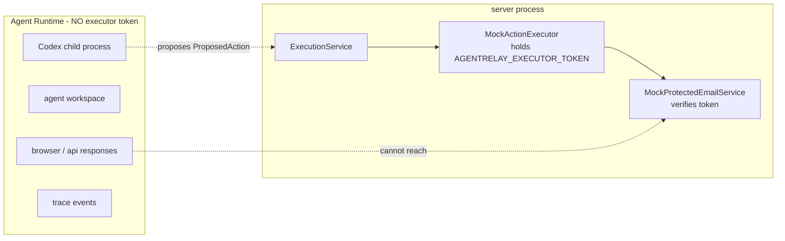

# AgentRelay Person 4: Hard Enforcement, Idempotency & Reliability (Integration) - Plan

Person 4 owns AgentRelay's security-critical runtime boundary: the single enforced route by which an agent-proposed action becomes a real external side effect. A complete P4 implementation exists on the `person4-hard-enforcement` branch. This plan brings those modules onto `feat/p4-work` and wires them into the live relay execution path.

> **Implementation outcome (2026-08-30).** Document review verified the `person4-hard-enforcement` branch is purely additive against its merge base (0 deletions, one trivial `config.test.ts` add/add conflict), so U1–U9 and U12 landed via `git merge` (`1a84e21`) rather than verbatim re-creation. The genuinely-new work is U10 (`91f6ab9`), U11/U13 (`a03a4a4`), and the review hardening (`71bbcfb`, `0846139`). `npm run check` green. The unit bodies below are kept for traceability; where "Approach" says "copy from the reference branch", that copy happened through the merge. See `PERSON_4_OWNERSHIP.md` § 9 for the full delivery log and open team-sync items.

---

## Goal Capsule

- **Objective:** An agent-proposed protected side effect (`SEND_EMAIL`) reaches the external service only after policy and, when required, a payload-bound human approval, and then executes exactly once. Every other route — direct service call, missing or forged credential, unapproved or denied action, modified-payload replay, duplicate request, retry after success — fails closed. A reviewer outside the middleware can verify this from the test suite alone.
- **Means:** Port the trusted `MockActionExecutor` (sole holder of `AGENTRELAY_EXECUTOR_TOKEN`) and its token-gated `MockProtectedEmailService`, front both the mock and the existing Resend delivery path with an `ExecutionService` that enforces approval and an atomic idempotency ledger, add a `RecoveryService` for timeout/retry/terminal-failure and an explicit degraded path, then replace the inline `actionExecutor.execute(...)` call in `relay-workflow-service.ts` with `ExecutionService.run(action, decision)` (KTD1–KTD12).
- **Authority:** `PERSON_4_OWNERSHIP.md` is the scope authority. The spec (`AgentRelay_TechJam_Engineering_Spec_v2.md` §§ 13, 14, 15, 21, 22) and `AgentRelay_5_Person_3_Day_Implementation_Plan.md` (§ "Person 4") win on any conflict with this document.
- **Stop conditions:** Stop and raise a cross-team contract question before editing `apps/server/src/domain/**`. Stop if the executor token would need to enter a `ProposedAction`, `ApprovedAction`, `ExecutionContext`, a `TraceEvent`, an `/api` response, a fixture, or a runner env allowlist. The integration units U10 and U11 edit Person 5's `relay-workflow-service.ts` / `index.ts` / `email-executor.ts`, and U13 adds one Person 1 coordinator assertion — these are flagged cross-team edits that need sign-off, not silent changes.
- **Execution profile:** Contract-first, port-then-integrate. Each ported module keeps its production impl + in-memory/mock deps + colocated Vitest tests + fixture. Build and green every P4 module against fakes (U1–U9) before the integration units (U10–U13).
- **Tail ownership:** Person 4 delivers `ExecutionService`, the ledger, the executor boundary, and the attack suite. Person 5 reviews the `relay-workflow-service.ts` / `index.ts` wiring. Person 1 owns whether a terminal `ExecutionOutcome` keeps coordinator downstream tasks blocked.

---

## Product Contract

### Summary

Port the hard enforcement boundary from `person4-hard-enforcement` onto current `main` and integrate it. Deliver: Person-4-owned contracts (`execution-ports.ts`, `execution-errors.ts`); a token-gated in-process `MockProtectedEmailService`; a trusted `MockActionExecutor` that alone holds the credential; an approval-enforced, idempotent `ExecutionService` returning `ExecutionOutcome`; a `RecoveryService` for timeout/retry/terminal failure and an explicit degraded/stale fallback; a JSON execution ledger with atomic claim; `AGENTRELAY_EXECUTOR_TOKEN` config wiring with a runner-env leak regression test; trace redaction at the executor boundary; the live wiring into `relay-workflow-service.ts` / `index.ts`; and the Day-3 bypass/abuse test suite (~17 scenarios).

### Problem Frame

AgentRelay's thesis is that one incorrect agent output must not silently become shared truth and trigger a real-world action. Approvals and policy are advisory only if the Agent Runtime (the Codex process, agent workspace, browser, prompts, traces) can perform the protected side effect directly, or if an approved action can fire twice, or if a failed action is silently skipped so downstream work proceeds on missing evidence. Today the live path in `relay-workflow-service.ts` calls `actionExecutor.execute(approved)` inline after an approval decision: there is no separate credential holder, the idempotency check is a non-atomic receipt lookup inside the executor, there is no retry/timeout, and a failed send only marks the session `degraded`. This plan makes the boundary enforced: the credential and the privileged call live in one trusted component, there is exactly one code path to it, approved actions execute exactly once, and a terminal failure is an explicit signal rather than a silent skip. This is the highest-priority implementation invariant in the project (spec § 25).

### Requirements

#### Credential isolation and the protected boundary

- R1. `MockProtectedEmailService` accepts a send request only when the caller presents the valid executor credential; a request without it, or with a wrong value, is rejected with a 403-shaped `ProtectedServiceAuthError` and no email is recorded.
- R2. The executor credential is available only to the `MockActionExecutor` (and to the mock service for verification). It never appears in `ProposedAction`, `ApprovedAction`, `ExecutionContext`, any `TraceEvent`, any `/api/relay/*` response, any fixture, or `codex-home/config.toml`.
- R3. Neither runner's child-process environment (`codex-runner.ts` `childEnvironment()`, `container-codex-runner.ts` `childEnvironment()`, and the container `--env` list built by `buildContainerRunArgs`) carries `AGENTRELAY_EXECUTOR_TOKEN`. A regression test asserts its absence and its value's absence.
- R4. An "agent-like" caller that attempts the protected side effect without the executor path fails (403 / unauthorized). The trusted executor path succeeds and returns a receipt.

#### Approval enforcement

- R5. `ExecutionService.run(action, decision)` executes an action only when `decision === "AUTO_EXECUTE"`, or `decision === "REQUIRE_APPROVAL"` and the `ApprovalVerifier` reports a satisfied payload-bound approval for that exact action. `NO_APPROVAL`, `APPROVAL_DENIED`, `APPROVAL_INVALIDATED`, and `HASH_MISMATCH` each stop execution with a terminal `action.failed` and no send.
- R6. Person 4 enforces the decision; it never re-derives policy, risk, impact, or the automation decision. `DENY` and `RECOMMEND_ONLY` reaching `ExecutionService.run` is a caller-contract violation and throws.
- R7. A protected action (`SEND_EMAIL`) with `decision === "AUTO_EXECUTE"` is refused without a send — the automation matrix never yields `AUTO_EXECUTE` for an external action, so this is an upstream misclassification and fails closed.

#### Idempotency — exactly once

- R8. The execution ledger record is keyed by `sessionId + "|" + actionId + "|" + payloadHash`. States are `pending → executing → succeeded | failed`.
- R9. The transition into `executing` is a single atomic compare-and-set inside one queued store mutation, not a read-then-write. Two concurrent `run` calls for the same key produce exactly one external send; the loser gets an in-progress outcome.
- R10. A call whose key is already `succeeded` returns the stored prior result and does not re-send. A call whose key is `executing` returns in-progress and does not double-fire. A key left `executing`/`pending` by a crashed process is reclaimed to `failed` on ledger load.

#### Reliability

- R11. A protected execution attempt has a timeout. Transient failure (attempt timeout, mock-service transient failure) is retried up to `maxAttempts`. `ProtectedServiceAuthError`, approval failure, and Zod validation failure are terminal and never retried. An unrecognised error type fails closed (terminal, no retry).
- R12. When attempts are exhausted the ledger record is `failed`, `ExecutionService.run` returns `ExecutionOutcome { terminal: true }`, and `relay-workflow-service` marks the session `failed` (or `degraded` only when the explicit fallback in R13 fired). No silent skip; downstream tasks stay blocked.
- R13. The degraded path is explicit and opt-in: when fresh execution is impossible and a known safe fallback exists, the fallback evidence is marked `stale`, the session is marked `degraded`, and the stale marker propagates to any downstream view. Fallback data is never presented as fresh.

#### Observability

- R14. Before any `TraceSink.append`, the executor boundary redacts values matching the executor token and `bearer <token>` patterns, and replaces the external payload with a summary (for example `payloadSummary: "SEND_EMAIL, 482 chars"`). Redaction happens before persistence, not before rendering.
- R15. The execution ledger persists only `payloadHash`, never `SendEmailPayload` fields (`recipient`, `subject`, `body`). A stored `result` keeps `status`, `externalReference`, and a redacted `error` string only. A write that would leak a payload field throws before persistence.

### Success Criteria

- The Day-3 attack suite (Definition of Done lists every scenario) passes. `npm run check` is green.
- A reviewer can point to one test that proves "duplicate request executes once" and one that proves "direct agent-side call fails", without reading terminal logs.
- The live browser demo path still works: create session → Research + Finance → Strategy → Outreach `SEND_EMAIL` → `REQUIRE_APPROVAL` → approve → exactly-once protected execution → receipt visible in the session view, all correlated in one trace.
- Baseline Agent CRUD, the Playground, and the existing relay/server tests still pass — no Layer 1 regression beyond the sanctioned `config.ts` / `.env.example` edits.

### Scope Boundaries

In scope: the files listed in `PERSON_4_OWNERSHIP.md` § 1, the two sanctioned config edits (`config.ts`, `.env.example`), and the flagged cross-team wiring edits in `relay-workflow-service.ts`, `index.ts`, `email-executor.ts`, and one coordinator test assertion (U10, U11, U13).

Out of scope:

- `json-trace-store.ts` and the `/api/relay/*` route shapes (Person 5). Person 4 emits trace events through the injected `RelayJsonStore` `TraceSink` and exposes `ExecutionService`.
- Risk classification, the automation decision gate, and approval record writes (Person 3). Person 4 reads approval state through the `ApprovalVerifier` port.
- Coordinator internals and the actual downstream-blocking mechanism (Person 1). Person 4 returns `outcome.terminal`; Person 1 consumes it.
- Any change to `apps/server/src/domain/**` — the frozen contracts already carry `AutomationDecision`, `ApprovedAction`, `protected-action.ts`, and the executor trace event types this plan needs. New contracts land in `execution-ports.ts` (KTD2).
- A real HTTP transport for the mock protected service (KTD1).

#### Deferred to Follow-Up Work

- **Optional HTTP façade for the mock service.** If the team's architecture diagram commits to an HTTP trust boundary, Person 5 can later mount `MockProtectedEmailService` behind a route; the in-process `send()` contract does not change (KTD1).
- **`AbortSignal` into `ExternalActionExecutor.execute`.** A timed-out in-process attempt is currently abandoned with a no-op `.catch()`. A real abort needs a `domain/ports.ts` change and team sign-off.
- **Bounded post-send ledger-write retry + reconciliation event.** If the ledger `update` to `succeeded` fails after a successful send, the reclaim-on-load path catches it as `failed`; a cleaner reconciliation is a follow-up.

### Sources

- `PERSON_4_OWNERSHIP.md` — scope, owned files, day-by-day exit criteria, contracts consumed and defined, credential-handling steps (§ 6), progress log (§ 9) recording the stale-branch build.
- `AgentRelay_TechJam_Engineering_Spec_v2.md` §§ 4.3, 13, 14, 15.1, 15.2, 16.2, 21, 22.
- `AgentRelay_5_Person_3_Day_Implementation_Plan.md` — "Person 4" and the per-day team exit criteria.
- Reference implementation to port: branch `person4-hard-enforcement` — `apps/server/src/adapters/{mock-protected-email-service,mock-action-executor,json-execution-store,in-memory-execution-store,execution-record,recording-trace-sink}.ts`, `apps/server/src/adapters/__fixtures__/actions.ts`, `apps/server/src/application/{execution-ports,execution-errors,execution-service,recovery-service,redact-trace,approval-verifier-fakes}.ts`, `apps/server/src/runner-env-isolation.test.ts`, and the `bypass.test.ts` / `enforcement-attacks.test.ts` suites. This branch already went through a 7-reviewer `ce-code-review` pass (see `PERSON_4_OWNERSHIP.md` § 9).
- Current integration surface: `apps/server/src/application/relay-workflow-service.ts:93-133` (`decideApproval` inline execution), `apps/server/src/application/email-executor.ts` (Mock + Resend `ExternalActionExecutor`), `apps/server/src/application/relay-store.ts` (`RelayActionReceipt`, receipt persistence), `apps/server/src/index.ts:21-40` (wiring), `apps/server/src/config.ts:56-59` (`EMAIL_EXECUTOR` / Resend).
- Patterns: `apps/server/src/store.ts` (`JsonStore` serialize-then-atomic-rename), `apps/server/src/errors.ts` (`HttpError`), `apps/server/src/config.test.ts` and `apps/server/src/application/email-executor.test.ts` (Vitest + `mkdtemp` fixture style), `apps/server/src/codex-runner.ts:242` and `apps/server/src/container-codex-runner.ts:240` (`childEnvironment()` allowlists), `apps/server/src/agent-service.ts` `initialize()` (interrupted-run reclaim precedent).

---

## Planning Contract

### What already exists (do not rebuild)

- Domain contracts on `main` already include everything P4 consumes: `domain/action.ts` (`AutomationDecision`, `ProposedAction`, `ApprovedAction` with `payloadHash` + `idempotencyKey`, `ActionResult`), `domain/protected-action.ts` (`PROTECTED_ACTION_TYPE`, `SendEmailPayload`, `ProtectedEmailRequest`, `ProtectedEmailReceipt`), `domain/ports.ts` (`ExternalActionExecutor`, `TraceSink`), `domain/trace.ts` (`action.execution_started`, `action.executed`, `action.failed`, `retry.scheduled`, `session.degraded`, …), `domain/approval.ts` (`ApprovalRecord`, status).
- `apps/server/src/application/approval-service.ts` exports `payloadHashFor(action)` = `sha256(canonicalJson({type, target, payload}))` — Person 3's hash. This is the authoritative `payloadHash`.
- `apps/server/src/application/email-executor.ts` — `MockEmailExecutor` and `ResendEmailExecutor` implement `ExternalActionExecutor`, save `RelayActionReceipt` for the UI, and validate the payload hash. Kept as the delivery layer (KTD3).
- The runner `childEnvironment()` allowlists are name-based and already exclude `AGENTRELAY_EXECUTOR_TOKEN` and `RESEND_API_KEY` — U9 adds only a regression test.

### What is missing (this plan builds it)

Credential holder + token-gated service, the idempotency ledger with atomic claim, the retry/timeout `RecoveryService`, the approval-enforcing `ExecutionService` returning `ExecutionOutcome`, trace redaction at the boundary, the explicit degraded path, `AGENTRELAY_EXECUTOR_TOKEN` config, and the live wiring replacing the inline `decideApproval` execution.

### Key Technical Decisions

- KTD1. **In-process `MockProtectedEmailService` with a token-checked `send()` method, not a real loopback HTTP listener.** (session-settled: user-directed — chosen over mock-only replacement and over a real HTTP listener: keeps the Resend real-email path and avoids port/process management.) The method signature and `ProtectedEmailReceipt` return shape match what an HTTP route would expose so Person 5 can wrap it later. Rejection is a `ProtectedServiceAuthError` carrying `statusCode: 403`. `send()` is idempotent on `sessionId|actionId` so a retry after a lost ACK returns the stored receipt. Residual risk: the one-page architecture diagram must not show an enforced HTTP boundary the implementation lacks — raise at the team sync. Governs R1, R4.
- KTD2. **New contracts live in `apps/server/src/application/execution-ports.ts` + `execution-errors.ts`, owned by Person 4.** `domain/**` is frozen. `ApprovalVerifier`, `ExecutionRecord`, `ExecutionRecordStatus`, `ExecutionRecordSeed`, `ExecutionStore`, `ExecutionOutcome`, `ExecutionService` in `execution-ports.ts`; `ProtectedServiceAuthError`, `ActionValidationError`, `TransientExecutionError` in `execution-errors.ts`. Propose moving the ports into `domain/ports.ts` later only on team agreement. Governs R5, R8, R11.
- KTD3. **The hardened boundary wraps both delivery executors; it does not replace them.** (session-settled: user-directed — chosen over mock-only: preserves the Resend demo capability.) `MockActionExecutor` (new, sole token holder) calls `MockProtectedEmailService` and is the `mock` provider; `ResendEmailExecutor` stays the `resend` provider with its own `RESEND_API_KEY`. `index.ts` selects one via `createEmailExecutor`, then `ExecutionService` wraps whichever is selected. Idempotency, approval enforcement, retry, and redaction are the `ExecutionService`'s job regardless of provider. The delivery executor still saves the `RelayActionReceipt` the session view renders. Governs R8, R11, R14.
- KTD4. **The atomic `pending → executing` claim is a compare-and-set inside one `JsonStore`-style mutation.** Reuse the serialize-through-a-promise-queue-then-atomic-rename pattern from `store.ts`. `claim(seed)` reads and sets `executing` in one critical section; it returns the claimed record, or `null` when a record for the key already exists (the caller then reads the existing record). No `if (!alreadyExecuted) execute()`. The ledger is a separate JSON file (`agentrelay-executions.json`), not a new collection on `RelayJsonStore`, to keep the atomic-claim logic isolated and Person-4-owned. Governs R9.
- KTD5. **The idempotency key is `sessionId + "|" + actionId + "|" + payloadHash`, derived from the action's own fields.** `payloadHash` is consumed from the `ApprovedAction` (produced by `payloadHashFor`), never recomputed with a different algorithm. When `action.idempotencyKey` is non-empty, `ExecutionService` asserts it equals the derived key and fails closed on mismatch. `relay-workflow-service.ts:117` currently sets `idempotencyKey` via `idempotencyKeyFor(action.id, approval.payloadHash)` = `sha256(actionId:payloadHash)` — U10 changes that call site to the `sessionId|actionId|payloadHash` form (or passes an empty string and lets `ExecutionService` derive it). Governs R8.
- KTD6. **Retry classification is a fixed table by thrown error type; delay is fixed and small (0 in tests).** Transient (retried): `TransientExecutionError` including the attempt-timeout wrapper. Terminal (never retried): `ProtectedServiceAuthError`, `ActionValidationError`, any approval-verifier failure. Unknown error type → terminal, fail closed. No exponential backoff in P0 — deterministic tests matter more than realistic pacing. Governs R11.
- KTD7. **The executor token is validated at executor construction, not globally.** `config.ts` adds `AGENTRELAY_EXECUTOR_TOKEN: z.string().min(24).optional()` and surfaces `config.executorToken`. `MockActionExecutor` throws on construction if the token is absent or starts with `replace-`. `ResendEmailExecutor` is unaffected. The server still boots when the token is unset and the mock executor is not constructed. Governs R2.
- KTD8. **Trace redaction is a Person-4 helper (`redact-trace.ts`) applied at the executor boundary before `TraceSink.append`.** `scrubSecrets(value, secrets)` deep-clones and replaces any string containing a known secret, or a `bearer <token>` credential, with `[REDACTED]`; `summarizePayload(type, payload)` returns a length summary. The explicit `secrets` list (the executor always knows its token) is the real control; there is no "looks random" heuristic (it broke UUID trace-id correlation on the reference branch). `ExecutionService` builds trace metadata from safe fields only and passes it through `scrubSecrets` as defense in depth. Governs R14.
- KTD9. **`ApprovalVerifier` is a port with test doubles, not a dependency on Person 3's `approval-service`.** `AlwaysApprovedVerifier`, `AlwaysDeniedVerifier`, `StubApprovalVerifier` for isolated development. The production impl is a thin adapter reading `RelayJsonStore.getApproval(...)` and checking `status === "approved"`, `actionId` match, and `payloadHash` match — wired in U10. Governs R5.
- KTD10. **`ExecutionService.run(action, decision)` returns a Person-4 `ExecutionOutcome`, not a bare `ActionResult`.** `ApprovedAction` (frozen) does not carry the decision, and `ActionResult` (frozen `{status, externalReference?, error?}`) has no metadata channel. `execution-ports.ts` defines `ExecutionOutcome { result: ActionResult; terminal: boolean; reason?: string }`. `relay-workflow-service` and, later, the coordinator read `outcome.terminal` to decide session status and downstream blocking. This differs from the `run(action)` signature sketched in `PERSON_4_OWNERSHIP.md` § 4 — raise at the team sync. Governs R6, R12.
- KTD11. **`ExecutionService` emits the executor-boundary trace events; it does not emit approval-lifecycle events.** `action.execution_started`, `retry.scheduled`, `action.executed`, `action.failed` (with a precise `metadata.reason` on refusal) belong to P4. `approval.granted` / `approval.denied` / `approval.invalidated` stay in `relay-workflow-service.decideApproval` (Person 3 / Person 5 territory). Trace emission is best-effort: a `TraceSink` failure is swallowed so it never wedges the ledger between `claim` and `update`. Governs R14.
- KTD12. **The degraded path is a branch in `relay-workflow-service`, not in `RecoveryService`.** `RecoveryService` only classifies and returns `ExecutionOutcome`. When `outcome.terminal` is true, `relay-workflow-service` decides: session `failed` by default; session `degraded` only when a caller explicitly supplied fallback evidence for the blocked task, in which case it marks that evidence `stale`, sets session `degraded`, emits `session.degraded`, and the session view surfaces the stale marker. Fallback is never fabricated by P4. Governs R13.

### High-Level Technical Design

Directional guidance for review, not implementation specification.

The one protected path after this plan:

```mermaid
flowchart TB
  A[relay-workflow-service.decideApproval\napproval approved] --> B[ExecutionService.run action, decision]
  B --> C{decision DENY / RECOMMEND_ONLY?}
  C -->|yes| Z1[throw caller-contract violation]
  C -->|no| D{SEND_EMAIL and AUTO_EXECUTE?}
  D -->|yes| F1[action.failed: PROTECTED_ACTION_REQUIRES_APPROVAL]
  D -->|no| E{decision REQUIRE_APPROVAL?}
  E -->|yes| G[ApprovalVerifier.isSatisfied]
  G -->|not ok| F2[action.failed: reason]
  E -->|no / verifier ok| H[ExecutionStore.claim key]
  H -->|null: existing record| I{status?}
  I -->|succeeded| J[return stored result, terminal false]
  I -->|executing| K[return in-progress]
  I -->|failed| L[return stored terminal outcome]
  H -->|claimed| M[emit action.execution_started]
  M --> N[RecoveryService.run: attempt with timeout,\nretry TransientExecutionError up to maxAttempts]
  N --> O[ExternalActionExecutor.execute\n= MockActionExecutor or ResendEmailExecutor]
  O --> P[MockActionExecutor holds AGENTRELAY_EXECUTOR_TOKEN\n-> MockProtectedEmailService.send token, request]
  P --> Q[ProtectedEmailReceipt]
  N --> R[ledger update succeeded | failed, attempts+1,\nredacted result]
  R --> S[emit action.executed | action.failed]
  S --> T[return ExecutionOutcome]
  T --> U{outcome.terminal?}
  U -->|no| V[session completed, receipt in view]
  U -->|yes + fallback evidence| W[evidence stale, session degraded, session.degraded]
  U -->|yes, no fallback| X[session failed, downstream stays blocked]
```

Credential isolation (unchanged topology, made explicit):



### Assumptions

- `payloadHashFor` (Person 3's `hash(type + target + canonicalJson(payload))`) is the single canonical hash. If Person 3's `approval-service` and any P4 fixture disagree on the hash algorithm, align the fixture to `payloadHashFor` (OQ1).
- The current single-active-workflow constraint in `RelayWorkflowService` (`this.active.size > 0` → 409) stays; the ledger is still keyed per action so concurrency tests exercise `ExecutionService` directly with an in-memory store.
- Person 5 accepts the `decideApproval` edit in principle (it is the only place the protected action executes today).

### Sequencing

U1 → U2 → U3 (boundary) and U1 → U6 (ledger) and U1 → U5 (verifier port) can proceed in parallel after U1. U4 (redact) is independent. U7 needs U2/U3. U8 needs U1, U5, U6, U7, U4. U9 is independent of the modules but needed before U10. U10 (integration) needs U8, U9. U11 (degraded) needs U10. U12 (attack suite) needs U8; the bypass subset needs only U2/U3/U5. U13 needs U10.

---

## Implementation Units

### Unit Index

| U-ID | Title | Files (primary) | Depends on |
| --- | --- | --- | --- |
| U1 | Port P4 contracts + error taxonomy | `application/execution-ports.ts`, `application/execution-errors.ts` | — |
| U2 | Port token-gated mock protected service | `adapters/mock-protected-email-service.ts` | U1 |
| U3 | Port trusted executor (sole token holder) | `adapters/mock-action-executor.ts` | U1, U2 |
| U4 | Port trace redaction helper | `application/redact-trace.ts` | — |
| U5 | Port ApprovalVerifier port + fakes | `application/approval-verifier-fakes.ts` | U1 |
| U6 | Port idempotency ledger (atomic claim) | `adapters/json-execution-store.ts`, `adapters/in-memory-execution-store.ts`, `adapters/execution-record.ts`, `adapters/recording-trace-sink.ts` | U1 |
| U7 | Port RecoveryService (timeout / retry / terminal) | `application/recovery-service.ts` | U1, U3 |
| U8 | Port ExecutionService (approval + idempotency + redacted trace) | `application/execution-service.ts` | U1, U4, U5, U6, U7 |
| U9 | Executor-token config + runner-env leak test | `config.ts`, `config.test.ts`, `.env.example`, `runner-env-isolation.test.ts` | — |
| U10 | Wire ExecutionService into the live relay path | `application/relay-workflow-service.ts`, `index.ts`, `application/relay-approval-verifier.ts`, `application/email-executor.ts` | U8, U9 |
| U11 | Explicit degraded / stale fallback branch | `application/relay-workflow-service.ts`, `application/recovery-service.ts` | U10 |
| U12 | Bypass + enforcement-attack suites + fixtures | `adapters/__fixtures__/actions.ts`, `adapters/bypass.test.ts`, `application/enforcement-attacks.test.ts` | U8 |
| U13 | Coordinator terminal-failure downstream-block assertion | `application/coordinator.test.ts` or `application/relay-workflow-service.test.ts` | U10 |

### U1. Port P4 contracts + error taxonomy

- **Goal:** The Person-4-owned interfaces and error types exist on `feat/p4-work`, importable by every later unit.
- **Requirements:** R5, R6, R8, R11 (contract shapes).
- **Files:** `apps/server/src/application/execution-ports.ts` (new), `apps/server/src/application/execution-errors.ts` (new).
- **Approach:** Copy both files verbatim from `person4-hard-enforcement`. `execution-ports.ts` defines `ApprovalVerifier` (`isSatisfied` → `{ok:true} | {ok:false, reason: "NO_APPROVAL" | "APPROVAL_DENIED" | "APPROVAL_INVALIDATED" | "HASH_MISMATCH"}`), `ExecutionRecordStatus`, `ExecutionRecord`, `ExecutionRecordSeed`, `ExecutionStore` (`get` / `claim` / `update`), `ExecutionOutcome`, `ExecutionService`. `execution-errors.ts` defines `ProtectedServiceAuthError` (`statusCode: 403`), `ActionValidationError`, `TransientExecutionError` (accepts `{cause}`). Verify imports resolve against current `domain/action.ts` (they do — `AutomationDecision`, `ApprovedAction`, `ActionResult` all present).
- **Test Scenarios:** Type-only unit; `Test expectation: none -- pure contracts, exercised by U2-U8 tests`. Confirm `npm run typecheck -w @launchpad/server` passes with the two new files.
- **Verification:** `npm run typecheck -w @launchpad/server`.

### U2. Port token-gated mock protected service

- **Goal:** An in-process service that accepts a send only with the verified executor token and is idempotent on `sessionId|actionId`.
- **Requirements:** R1, R4.
- **Files:** `apps/server/src/adapters/mock-protected-email-service.ts` (new), `apps/server/src/adapters/mock-protected-email-service.test.ts` (new). Create `apps/server/src/adapters/` if absent.
- **Approach:** Copy from the reference branch. Constructor takes `{ expectedToken, now? }`. `send(token, request)` uses `timingSafeEqual` on equal-length buffers, throws `ProtectedServiceAuthError` on any mismatch (including empty / wrong length), dedupes on `${sessionId}|${actionId}` returning the stored `ProtectedEmailReceipt`, supports `failNextSends(count)` and `failNextSendWith(error)` test hooks, exposes `sent` / `sentCount`. Receipt is `{ messageId: "msg-N", acceptedAt }`.
- **Test Scenarios:**
  - Valid token + request → `ProtectedEmailReceipt` with `messageId: "msg-1"`; `sentCount` is 1.
  - Empty string, wrong-length string, and correct-length-wrong-value token → each rejects with `ProtectedServiceAuthError`; `sentCount` stays 0.
  - Same `sessionId|actionId` sent twice → second returns the identical receipt; `sentCount` stays 1.
  - `failNextSends(1)` then send → first throws a generic `Error` (not `ProtectedServiceAuthError`); a following send succeeds.
  - `failNextSendWith(new Error("boom"))` → next send throws exactly that error.
- **Verification:** `npm run test -w @launchpad/server -- src/adapters/mock-protected-email-service.test.ts`.

### U3. Port trusted executor (sole token holder)

- **Goal:** The only component that holds the executor token; validates the payload with Zod; maps failures to the P4 error taxonomy.
- **Requirements:** R1, R2, R4, R11.
- **Files:** `apps/server/src/adapters/mock-action-executor.ts` (new), `apps/server/src/adapters/mock-action-executor.test.ts` (new).
- **Approach:** Copy from the reference branch. `implements ExternalActionExecutor`. Constructor `{ token, service }` throws if `token.length < 24` or `token.startsWith("replace-")`. `execute(action)`: reject non-`SEND_EMAIL` with `ActionValidationError`; parse `action.payload` with a strict `{recipient, subject, body}` min-1 schema, `ActionValidationError` on failure; call `service.send(this.token, {sessionId, actionId, payload})`; re-throw `ProtectedServiceAuthError` as-is; wrap any other throw in `TransientExecutionError`; return `{status: "succeeded", externalReference: receipt.messageId}`.
- **Test Scenarios:**
  - Valid approved `SEND_EMAIL` → `{status: "succeeded", externalReference: "msg-1"}`.
  - Construction with a 10-char token, and with `"replace-me-..."` → throws.
  - `action.type = "CREATE_INTERNAL_DRAFT"` → `ActionValidationError`, no `service.send`.
  - `payload` missing `body` → `ActionValidationError`, no `service.send`.
  - Service configured with a different `expectedToken` → `execute` throws `ProtectedServiceAuthError` (re-thrown, not wrapped).
  - Service `failNextSends(1)` → `execute` throws `TransientExecutionError` wrapping the message.
  - `JSON.stringify` of every argument the executor passes onward contains no token substring.
- **Verification:** `npm run test -w @launchpad/server -- src/adapters/mock-action-executor.test.ts`.

### U4. Port trace redaction helper

- **Goal:** A pure helper that strips known secrets and `bearer` credentials from trace metadata and summarizes protected payloads, applied before persistence.
- **Requirements:** R14.
- **Files:** `apps/server/src/application/redact-trace.ts` (new), `apps/server/src/application/redact-trace.test.ts` (new).
- **Approach:** Copy from the reference branch. `scrubSecrets<T>(value, secrets)` deep-clones and replaces any string containing a non-empty secret with `[REDACTED]`, and replaces `bearer\s+\S+` with `bearer [REDACTED]`. `summarizePayload(type, payload)`: for `SEND_EMAIL` with a string `body`, return `"SEND_EMAIL, <body.length> chars"`; otherwise `"<type>, <json-length> chars"`. No entropy/length heuristic.
- **Test Scenarios:**
  - Metadata object containing the executor token at a nested key → returned clone has `[REDACTED]` there, siblings untouched.
  - String `"Authorization: bearer abc.def"` → `"...bearer [REDACTED]"`.
  - A UUID-shaped `traceId` / `actionId` with no secret match → passes through unchanged (correlation preserved).
  - `summarizePayload("SEND_EMAIL", {recipient, subject, body: "x".repeat(482)})` → `"SEND_EMAIL, 482 chars"`.
  - `summarizePayload("CREATE_INTERNAL_DRAFT", {note: "hi"})` → `"CREATE_INTERNAL_DRAFT, <n> chars"`, never the raw `note`.
  - `scrubSecrets` with an empty `secrets` array → only `bearer` redaction applies.
- **Verification:** `npm run test -w @launchpad/server -- src/application/redact-trace.test.ts`.

### U5. Port ApprovalVerifier port + fakes

- **Goal:** Test doubles for the approval-verification port so U8 and other people's tests can run without Person 3's code.
- **Requirements:** R5.
- **Files:** `apps/server/src/application/approval-verifier-fakes.ts` (new), `apps/server/src/application/approval-verifier-fakes.test.ts` (new, small).
- **Approach:** Copy from the reference branch. `AlwaysApprovedVerifier` → `{ok:true}`; `AlwaysDeniedVerifier` → `{ok:false, reason:"APPROVAL_DENIED"}`; `StubApprovalVerifier` with a per-`actionId` map and a configurable fallback.
- **Test Scenarios:**
  - `AlwaysApprovedVerifier.isSatisfied(anyAction)` → `{ok:true}`.
  - `AlwaysDeniedVerifier` → `{ok:false, reason:"APPROVAL_DENIED"}`.
  - `StubApprovalVerifier({ok:true}).set("a1", {ok:false, reason:"HASH_MISMATCH"})` → `a1` gets the mismatch, any other id gets the fallback.
- **Verification:** `npm run test -w @launchpad/server -- src/application/approval-verifier-fakes.test.ts`.

### U6. Port idempotency ledger (atomic claim)

- **Goal:** A JSON-backed and an in-memory `ExecutionStore` whose `claim` is a single-winner compare-and-set, with crash reclaim on load and a payload-leak guard.
- **Requirements:** R8, R9, R10, R15.
- **Files:** `apps/server/src/adapters/json-execution-store.ts` (new), `apps/server/src/adapters/json-execution-store.test.ts` (new), `apps/server/src/adapters/in-memory-execution-store.ts` (new), `apps/server/src/adapters/in-memory-execution-store.test.ts` (new), `apps/server/src/adapters/execution-record.ts` (new), `apps/server/src/adapters/recording-trace-sink.ts` (new).
- **Approach:** Copy from the reference branch. `execution-record.ts`: `newExecutingRecord(seed, ts)` and `assertNoPayloadLeak(record)` (throws on `recipient`/`subject`/`body`/`payload` keys or a non-`{status,externalReference,error}` result). `JsonExecutionStore(filePath, now?)`: one file, `{version:1, records:{}}`, mutations serialized through a promise queue then temp-file + atomic `rename` (mirror `store.ts`); `initialize()` loads and calls `reclaimInterrupted()` moving any `executing`/`pending` record to `failed` with `error: "RECLAIMED_AFTER_INTERRUPT"`; `claim(seed)` returns `null` if the key exists else creates the `executing` record; `update(record)` runs `assertNoPayloadLeak` first. `InMemoryExecutionStore` mirrors the semantics with a promise-chain mutex. The relay ledger file path is `path.join(config.dataDirectory, "agentrelay-executions.json")` (wired in U10).
- **Test Scenarios:**
  - `claim` a fresh key → `executing` record with `attempts: 0`; a second `claim` of the same key → `null`; `get(key)` returns the first record.
  - 20 concurrent `claim` calls for one key (`Promise.all`) → exactly one non-null result.
  - `update` to `succeeded` then `get` → stored `result`; `update` with a record carrying `recipient` → throws before write.
  - `update` with `result: {status:"succeeded", secretField:"x"}` → throws.
  - Write a ledger file by hand with a record stuck in `executing`, construct a new store, `initialize()` → that record is `failed` with `RECLAIMED_AFTER_INTERRUPT`, and the file is rewritten.
  - Persisted JSON on disk (`readFile`) contains `payloadHash` but none of `recipient` / `subject` / `body`.
  - `InMemoryExecutionStore`: same `claim` single-winner and `assertNoPayloadLeak` behavior.
- **Verification:** `npm run test -w @launchpad/server -- src/adapters/json-execution-store.test.ts src/adapters/in-memory-execution-store.test.ts`.

### U7. Port RecoveryService (timeout / retry / terminal)

- **Goal:** Run one protected execution with a per-attempt timeout and bounded retries, classifying purely by thrown error type.
- **Requirements:** R11, R12.
- **Files:** `apps/server/src/application/recovery-service.ts` (new), `apps/server/src/application/recovery-service.test.ts` (new).
- **Approach:** Copy from the reference branch. `run(action, {executor, maxAttempts, timeoutMs, delayMs?, onRetry?})`: loop `1..maxAttempts`; each attempt races `executor.execute(action)` against a `setTimeout` that rejects with `TransientExecutionError("attempt timed out after Nms")`; attach a no-op `.catch()` to the abandoned attempt promise; on `ProtectedServiceAuthError` / `ActionValidationError` → return terminal immediately; on a non-`TransientExecutionError` → terminal `UNKNOWN_EXECUTION_ERROR`; on `TransientExecutionError` → `await onRetry(attempt)`, optional fixed `delayMs`, continue; after the loop → terminal `retries exhausted...`. Returns `ExecutionOutcome`.
- **Test Scenarios:**
  - Executor succeeds first try → `{terminal:false, result.status:"succeeded"}`, `onRetry` never called.
  - Executor throws `TransientExecutionError` once then succeeds, `maxAttempts:2` → succeeds, `onRetry(1)` called once.
  - Executor always times out (`execute` never resolves within `timeoutMs`), `maxAttempts:2` → `{terminal:true}`, reason mentions "retries exhausted", `onRetry(1)` called once.
  - Executor throws `ProtectedServiceAuthError` → `{terminal:true}` after one attempt, `onRetry` never called.
  - Executor throws a plain `Error("weird")` → `{terminal:true}`, reason starts `UNKNOWN_EXECUTION_ERROR`.
  - A timed-out attempt that later rejects → no `unhandledRejection` (assert process does not emit).
- **Verification:** `npm run test -w @launchpad/server -- src/application/recovery-service.test.ts`.

### U8. Port ExecutionService (approval + idempotency + redacted trace)

- **Goal:** The public P4 surface: enforce the decision, run the atomic guard, delegate the retry loop, emit redacted trace events, return `ExecutionOutcome`.
- **Requirements:** R5, R6, R7, R9, R10, R12, R14.
- **Files:** `apps/server/src/application/execution-service.ts` (new), `apps/server/src/application/execution-service.test.ts` (new).
- **Approach:** Copy from the reference branch. `run(action, decision)`:
  - `DENY` / `RECOMMEND_ONLY` → throw (caller-contract violation).
  - `SEND_EMAIL` + `AUTO_EXECUTE` → `fail(action, "PROTECTED_ACTION_REQUIRES_APPROVAL")` (emit `action.failed`, return terminal).
  - Derive `key = sessionId|actionId|payloadHash`; if `action.idempotencyKey` set and `!== key` → `fail(action, "IDEMPOTENCY_KEY_MISMATCH")`.
  - `REQUIRE_APPROVAL` → `verifier.isSatisfied(action)`; `!ok` → `fail(action, verdict.reason)`.
  - `store.claim(seed)`; `null` → read existing: `succeeded` → return stored result `terminal:false`; `failed` → stored terminal; else in-progress `{result:{status:"executing"}, terminal:false}`.
  - `emit(action, "action.execution_started", decision)`; `recovery.run(...)` with `onRetry` emitting `retry.scheduled`; redact `result.error` and `reason` via `scrubSecrets`; `store.update(...)` to `succeeded` | `failed`, `attempts+1`; `emit` `action.executed` | `action.failed`; return the outcome.
  - `emit` builds metadata from safe fields + `summarizePayload`, runs `scrubSecrets`, and swallows `sink.append` failures.
- **Test Scenarios:**
  - `REQUIRE_APPROVAL` + satisfied verifier → one send, `action.executed` emitted, `terminal:false`.
  - `REQUIRE_APPROVAL` + `{ok:false, reason:"APPROVAL_INVALIDATED"}` → no send, `action.failed` with `reason: "APPROVAL_INVALIDATED"`, `terminal:true`, no ledger claim persisted.
  - `SEND_EMAIL` + `AUTO_EXECUTE` → refused, no verifier call, no send, `action.failed` reason `PROTECTED_ACTION_REQUIRES_APPROVAL`.
  - `DENY` and `RECOMMEND_ONLY` → `run` rejects.
  - Duplicate `run` after `succeeded` → returns the stored outcome, `service.sentCount` stays 1.
  - Two concurrent `run` for one key → exactly one send; the loser gets `result.status:"executing"`.
  - Seeded `executing` ledger record → fresh `run` returns in-progress, no send.
  - Seeded `failed` ledger record → `run` returns the stored terminal outcome, no retry.
  - `action.target` set to the executor token, and `body` containing it → emitted trace metadata and persisted `result` show `[REDACTED]`, never the token.
  - Failure reason from the service containing the token → redacted before `store.update` and before `sink.append`.
  - `action.idempotencyKey` set to a wrong value → `fail` with `IDEMPOTENCY_KEY_MISMATCH`.
  - `sink.append` throws on every call → `run` still completes and returns the correct outcome; ledger reaches a terminal state.
- **Verification:** `npm run test -w @launchpad/server -- src/application/execution-service.test.ts`.

### U9. Executor-token config + runner-env leak test

- **Goal:** `AGENTRELAY_EXECUTOR_TOKEN` is a validated config value, documented, and proven absent from both runners' child environments.
- **Requirements:** R2, R3.
- **Files:** `apps/server/src/config.ts` (edit — sanctioned), `apps/server/src/config.test.ts` (edit), `.env.example` (edit — sanctioned), `apps/server/src/runner-env-isolation.test.ts` (new).
- **Approach:** Add `AGENTRELAY_EXECUTOR_TOKEN: z.string().min(24).optional()` to the Zod schema and `executorToken: env.AGENTRELAY_EXECUTOR_TOKEN?.trim() ?? ""` to the returned config. Keep the existing `EMAIL_EXECUTOR` / `RESEND_*` keys (KTD3 keeps Resend). Add a commented `.env.example` block: held only by the protected executor, never shared with the Agent Runtime, distinct from `APP_AUTH_TOKEN`, 24+ chars. Port `runner-env-isolation.test.ts` from the reference branch: set `process.env.AGENTRELAY_EXECUTOR_TOKEN` to a sentinel, assert `new CodexRunner(config()).childEnvironment()` and `new ContainerCodexRunner(config()).childEnvironment()` carry neither the key nor the sentinel value, and `buildContainerRunArgs(request, config())` does not reference either; also assert `ARK_API_KEY` / `GEMINI_API_KEY` are still forwarded. `childEnvironment` is private — access via a typed cast as the reference test does.
- **Test Scenarios:**
  - `loadConfig({NODE_ENV:"test", AGENTRELAY_EXECUTOR_TOKEN:"<32 chars>"}).executorToken` equals the token.
  - `loadConfig({NODE_ENV:"test", AGENTRELAY_EXECUTOR_TOKEN:"too-short"})` throws.
  - `loadConfig({NODE_ENV:"test"}).executorToken` is `""` and the call succeeds.
  - `CodexRunner` child env: no `AGENTRELAY_EXECUTOR_TOKEN` key, sentinel value not in `Object.values(env)`.
  - `ContainerCodexRunner` child env: same.
  - Container argv: `AGENTRELAY_EXECUTOR_TOKEN` not in `argv`, sentinel not in `argv.join(" ")`.
  - `CodexRunner` child env still has `ARK_API_KEY` and `GEMINI_API_KEY`.
- **Verification:** `npm run test -w @launchpad/server -- src/config.test.ts src/runner-env-isolation.test.ts`.

### U10. Wire ExecutionService into the live relay path

- **Goal:** The one place a protected action executes today (`relay-workflow-service.decideApproval`) goes through `ExecutionService.run`, with a production `ApprovalVerifier` and the executor token supplied only to `MockActionExecutor`.
- **Requirements:** R2, R5, R6, R8, R10, R12, R14. Cross-team: touches Person 5's `relay-workflow-service.ts` and `index.ts` — flag for P5 sign-off in the PR.
- **Files:** `apps/server/src/application/relay-workflow-service.ts` (edit), `apps/server/src/index.ts` (edit), `apps/server/src/application/relay-approval-verifier.ts` (new), `apps/server/src/application/email-executor.ts` (edit), `apps/server/src/application/relay-workflow-service.test.ts` (edit).
- **Approach:**
  - `relay-approval-verifier.ts`: `RelayApprovalVerifier implements ApprovalVerifier`, constructed with `RelayJsonStore`. `isSatisfied(action)` looks up `getApproval(\`approval-${action.id}\`)`; `null` → `{ok:false, reason:"NO_APPROVAL"}`; `status === "denied"` → `APPROVAL_DENIED`; `status === "invalidated"` → `APPROVAL_INVALIDATED`; `payloadHash !== action.payloadHash` → `HASH_MISMATCH`; `status === "approved"` and hash matches → `{ok:true}`; anything else (`pending`) → `{ok:false, reason:"NO_APPROVAL"}`.
  - `email-executor.ts`: make `MockEmailExecutor` delegate delivery to an injected `MockProtectedEmailService` (holding `config.executorToken`) instead of minting `mock-email-<uuid>` directly, so the mock path is token-gated too. `MockActionExecutor` from U3 is the token holder; `MockEmailExecutor` becomes a thin `ExternalActionExecutor` that calls it and still saves the `RelayActionReceipt`. `ResendEmailExecutor` unchanged. Keep `idempotencyKeyFor` exported but stop using it for the ledger key.
  - `index.ts`: construct `MockProtectedEmailService({expectedToken: config.executorToken})` when `config.emailExecutor === "mock"`; construct the `JsonExecutionStore(path.join(config.dataDirectory, "agentrelay-executions.json"))` and `await` its `initialize()`; construct `ExecutionService({verifier: new RelayApprovalVerifier(relayStore), store, executor: emailExecutor, recovery: new RecoveryService(), sink: relayStore, traceId: ..., secrets: [config.executorToken].filter(Boolean), maxAttempts: 3, timeoutMs: 10_000})`. Pass `ExecutionService` into `RelayWorkflowService` (new constructor param, replacing or alongside `actionExecutor`).
  - `relay-workflow-service.ts` `decideApproval`: after `saveApproval({...status:"approved"})` and the `approval.granted` trace, build `approved: ApprovedAction` with `payloadHash: approval.payloadHash` and `idempotencyKey: ""` (let `ExecutionService` derive it). Replace the `try { const result = await this.actionExecutor.execute(approved); ... }` block with `const outcome = await this.executionService.run(approved, "REQUIRE_APPROVAL");`. On `!outcome.terminal` and `result.status === "succeeded"` → session `completed`. On `outcome.terminal` → session `failed` (U11 refines to `degraded` when fallback exists), keep the approval recorded, throw `HttpError(502, ...)`. `ExecutionService` now emits `action.execution_started` / `action.executed` / `action.failed` / `retry.scheduled`, so remove those manual `this.trace(...)` calls from `decideApproval` to avoid duplicates (KTD11).
  - The stale-branch `bypass`/`attack` suites reference `ExecutionService` wiring; keep the live wiring shape compatible with U12's `wire()` helper.
- **Test Scenarios:**
  - Full `decideApproval("approve")` happy path with a `StubApprovalVerifier`-equivalent real approval record → session `completed`, exactly one `RelayActionReceipt`, trace contains `action.execution_started` then `action.executed` exactly once each.
  - `decideApproval` called twice concurrently for the same approval (or approve then a duplicate execute) → one send, one receipt; the second returns without a second `action.executed`.
  - Approval record `status: "pending"` when `run` is reached (race) → `ExecutionService` fails closed, session not `completed`.
  - Payload mutated after approval so `approval.payloadHash !== payloadHashFor(action)` → existing `decideApproval` invalidation path still fires `approval.invalidated` before `run` is called; if it reaches `run`, `HASH_MISMATCH` terminal.
  - `index.ts` boot with `AGENTRELAY_EXECUTOR_TOKEN` unset and `EMAIL_EXECUTOR=mock` → `MockActionExecutor` construction throws a clear error at startup (documented) OR the mock service is constructed with an empty token and every `send` 403s (pick one; prefer failing fast at boot with a readable message).
  - `/api/relay/sessions/:id` response body for a completed session → contains the receipt but no token substring (`JSON.stringify(body)` assertion).
- **Verification:** `npm run test -w @launchpad/server -- src/application/relay-workflow-service.test.ts` and `npm run check`.

### U11. Explicit degraded / stale fallback branch

- **Goal:** A terminal execution failure marks the session `failed` unless an explicit safe fallback was supplied, in which case the session is `degraded`, the fallback evidence is `stale`, and the stale marker propagates.
- **Requirements:** R13.
- **Files:** `apps/server/src/application/relay-workflow-service.ts` (edit), `apps/server/src/application/recovery-service.ts` (no logic change; confirm `ExecutionOutcome.reason` carries enough for the branch), `apps/server/src/application/relay-workflow-service.test.ts` (edit).
- **Approach:** In `decideApproval`, when `outcome.terminal`: check whether the session/task has fallback evidence available (for the demo, a `scenario`-driven flag or a pre-seeded `EvidenceRecord` with a `fallback: true`-equivalent marker on the outreach task). If yes → set that evidence `status: "stale"`, save session `status: "degraded"`, emit `session.degraded` with `metadata: { reason: outcome.reason, taskId }`, and the session view surfaces the stale evidence badge. If no fallback → session `failed`, emit `session.failed`, downstream stays blocked. Never synthesise fallback content. Document that P0 demo uses a single known fallback for the outreach task only.
- **Test Scenarios:**
  - Terminal failure, no fallback evidence → session `failed`, `session.failed` trace, no evidence mutated.
  - Terminal failure, fallback evidence present → session `degraded`, that evidence `status: "stale"`, `session.degraded` trace with the reason, other evidence untouched.
  - Session view for the degraded session → the stale evidence is flagged stale; the fresh evidence is not.
  - Fallback path does not fire on a non-terminal outcome (success or in-progress).
- **Verification:** `npm run test -w @launchpad/server -- src/application/relay-workflow-service.test.ts`.

### U12. Bypass + enforcement-attack suites + fixtures

- **Goal:** One place a reviewer reads to see every bypass route fail and the one sanctioned route succeed.
- **Requirements:** R1–R15 (attack coverage).
- **Files:** `apps/server/src/adapters/__fixtures__/actions.ts` (new), `apps/server/src/adapters/bypass.test.ts` (new), `apps/server/src/application/enforcement-attacks.test.ts` (new).
- **Approach:** Copy from the reference branch, adjusting the `wire()` helper to the U10 constructor shape. `__fixtures__/actions.ts`: `actionHash(type, target, payload)` aligned to `payloadHashFor` (OQ1 — use the same canonical-JSON algorithm, not `${type}\n${target}\n${JSON.stringify(payload)}`, unless the team confirms they match); `approvedEmailAction(overrides?)` builds an `ApprovedAction` with a correct `payloadHash` and derived `idempotencyKey`.
- **Test Scenarios (bypass.test.ts):**
  - An agent-like caller trying `["", "undefined", APP_AUTH_TOKEN, "SEND_EMAIL", actionId]` as the token → each rejects with `ProtectedServiceAuthError`; `sentCount` 0.
  - Trusted `MockActionExecutor` path → `succeeded`, `messageId: "msg-1"`, `sentCount` 1.
  - `AlwaysDeniedVerifier` verdict → `{ok:false}`; the executor is never called; `sentCount` 0.
  - `JSON.stringify(approvedEmailAction())` contains no executor-token substring.
- **Test Scenarios (enforcement-attacks.test.ts):**
  - Direct service call with no executor path → fails.
  - Forged token → `ProtectedServiceAuthError`.
  - Missing token → `MockActionExecutor` construction throws.
  - Unapproved action → terminal, no send.
  - Denied action → terminal, no send.
  - Modified approved payload (hash mismatch) → terminal, no send.
  - Concurrent duplicate requests → exactly one send.
  - Retry after success → no re-send.
  - Retry after partial failure (`failNextSends(1)`, `maxAttempts:2`) → exactly one send.
  - `AUTO_EXECUTE` for a protected action → refused, no send.
  - A token-like string in an emitted field → never reaches a trace event or the ledger (`RecordingTraceSink` + on-disk ledger assertions).
  - Terminal failure → `outcome.terminal === true` for the Coordinator.
  - On-disk ledger holds no payload fields (R15).
- **Verification:** `npm run test -w @launchpad/server -- src/adapters/bypass.test.ts src/application/enforcement-attacks.test.ts`.

### U13. Coordinator terminal-failure downstream-block assertion

- **Goal:** Prove that a terminal `ExecutionOutcome` keeps downstream tasks blocked and the session does not reach `completed`. Cross-team with Person 1.
- **Requirements:** R12.
- **Files:** `apps/server/src/application/relay-workflow-service.test.ts` (edit) — or a new assertion in `coordinator.test.ts` if Person 1 prefers it there; coordinate.
- **Approach:** Drive a workflow to the outreach `SEND_EMAIL`, force `ExecutionService.run` to a terminal outcome (inject a `RecoveryService` whose executor always throws `TransientExecutionError`, or a `MockProtectedEmailService` with `failNextSends(99)`), approve, and assert: session ends `failed` (or `degraded` with U11 fallback), no `session.completed` trace, and any task that depended on the outreach action's success is not advanced. Keep the assertion about the *observable* session/task state, not coordinator internals.
- **Test Scenarios:**
  - Approve with a permanently-failing executor → session `failed`, `action.failed` in trace, `session.completed` absent.
  - With U11 fallback present → session `degraded`, not `failed`, and still no `session.completed`.
- **Verification:** `npm run test -w @launchpad/server -- src/application/relay-workflow-service.test.ts`.

---

## Verification Contract

| Gate | Command | Applies to |
| --- | --- | --- |
| Typecheck | `npm run typecheck` | every unit; U1 is typecheck-only |
| P4 module tests | `npm run test -w @launchpad/server -- src/adapters src/application/execution-service.test.ts src/application/recovery-service.test.ts src/application/redact-trace.test.ts src/application/relay-approval-verifier.test.ts src/application/enforcement-attacks.test.ts` | U2–U8, U12 |
| Config + isolation | `npm run test -w @launchpad/server -- src/config.test.ts src/runner-env-isolation.test.ts` | U9 |
| Integration | `npm run test -w @launchpad/server -- src/application/relay-workflow-service.test.ts` | U10, U11, U13 |
| Full gate | `npm run check` | before PR — typecheck → test → build, must stay green |
| Manual demo smoke | `npm run dev`, run the sales-recovery workflow in the browser to the approved `SEND_EMAIL`, confirm one receipt and one correlated trace | U10 |

Redaction and credential-isolation checks are behavioral, not generic "run tests": U9's `runner-env-isolation.test.ts` and U12's ledger/trace assertions are the load-bearing proofs and must be named in the PR description.

---

## Definition of Done

### Global

- `npm run check` green: typecheck, all Vitest suites, build.
- Baseline Agent CRUD and the Playground still work; no Layer 1 change beyond the `config.ts` / `.env.example` edits in U9.
- `PERSON_4_OWNERSHIP.md` § 9 progress log gets one appended entry: what landed, the cross-team edits made (`relay-workflow-service.ts`, `index.ts`, coordinator assertion), and the open contract items raised (KTD10 `run(action, decision)` signature, KTD1 HTTP-boundary note for the architecture diagram, OQ1 hash alignment).
- No abandoned/experimental code left in the diff; `idempotencyKeyFor` either kept with a comment on why or removed.
- The executor token appears in exactly two places in the codebase: `config.ts` (schema + surfaced value) and where `MockActionExecutor` / `MockProtectedEmailService` read it. `grep -rn "executorToken\|AGENTRELAY_EXECUTOR_TOKEN" apps` confirms nothing in `domain/`, runners, routes, fixtures, or trace code.

### Attack suite (all must pass — U12, plus U9, U13)

direct service call · missing token · forged token · unapproved action · denied action · modified approved payload (hash mismatch) · concurrent duplicate requests execute once · retry after success does not re-send · retry after partial failure sends once · `AUTO_EXECUTE` for a protected action refused · secret in an emitted field never reaches a trace or the ledger · on-disk ledger holds no payload fields · runner child env (both runners) + container argv carry neither the token key nor its value · terminal failure keeps the session out of `completed` and downstream blocked.

### Per-unit

Each unit is done when its Test Scenarios pass, its Verification command is green, and (U2–U8, U12) the module ships production impl + mock/in-memory deps + colocated tests + a fixture, per the contract-first rule.

---

## Open Questions

- OQ1 (blocking for U12 fixtures, deferred elsewhere). Does Person 3's `payloadHashFor` (`sha256(canonicalJson({type, target, payload}))`) produce the same digest as the reference branch fixture's `actionHash` (`sha256(\`${type}\n${target}\n${JSON.stringify(payload)}\`)`)? They differ in algorithm. Resolution: `__fixtures__/actions.ts` must use `payloadHashFor` (import it, or reproduce its canonical-JSON exactly). Confirm with Person 3 that `approval.payloadHash` and any `actionHash` in the approval record are the same value.
- OQ2 (deferred). Should the production `ApprovalVerifier` wrap Person 3's `approval-service` directly rather than reading `RelayJsonStore.getApproval` (U10 does the latter, matching how `relay-workflow-service` already reads approvals)? Revisit if Person 3 ships a dedicated verification method.
- OQ3 (deferred). Startup behavior when `EMAIL_EXECUTOR=mock` and `AGENTRELAY_EXECUTOR_TOKEN` is unset: fail fast at boot with a readable message (recommended), or boot and 403 every send? Pick during U10.
